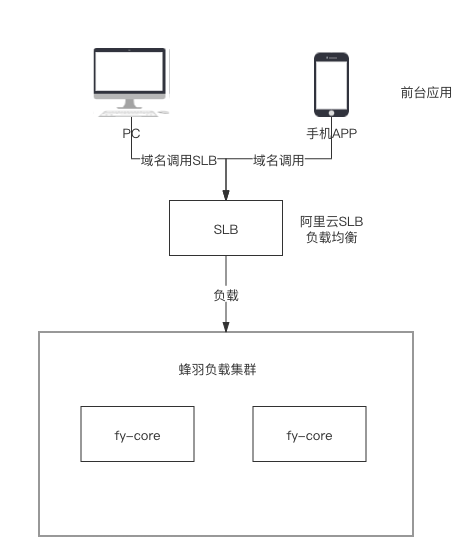

蜂羽系统交互

蜂羽 > BFF架构设计-服务前端的后端 > 未命名文件.png

这个是在系统未升级之前的系统调用方式，前端系统，通过配置的域名，访问SLB，然后在访问系统集群。

这种调用方式，在单体应用下是很常见的，那么如果是在微服务架构下面呢？

微服务架构
微服务架构方案-1
蜂羽 > BFF架构设计-服务前端的后端 > 未命名文件 (2).png

在这个方案里面，后端采用了微服务架构，增加了网关，SLB是直接访问到网关来的，通过网关可以直接路由对应的微服务里面去。

优点：

在微服务架构下，前后端交互的较为简单。
流程简单，调用链路较短，效率还是比较高的
缺点：

对于内部服务来说，不够安全，比如说：服务A，里面有一部分接口是给平台管理员提供的，有一部分是给C端用户提供的，虽然平台和C端的网关不一样，但是如果说把对应的
服务的路由加进去的话，那么这个服务的接口，就相当于对外全部开放了，这是及其不安全的，补救措施就是针对特定的接口做路由/或者做鉴权，但是还是比较恶心，开发写代码需要
考虑很多事情
针对页面上，有一个列表数据的展示，需要多个服务的数据聚合，那么这个接口写在哪个服务里面？ 其实写在哪个服务里面都不好，在微服务环境下， 能避免互相依赖就避免，每个服务的
职责尽量单一。 （其实实际推行过程中，在跨小组/跨团队之间，这个事情更难推）
后端服务的变动，会直接影响到前端的接口。没有达到纯粹的前后端分离

微服务架构方案-BFF

BFF是（Backends For Frontends）单词的缩写，主要是用于服务前端的后台应用程序，来解决多访问终端业务耦合问题。

蜂羽 > BFF架构设计-服务前端的后端 > 未命名文件 (3).png

在这个方案中，我们可以看到，针对每个客户端，单独开了一个接口层，每个客户端能够访问哪些接口都是固定的。

优点

构建了一个安全可靠的微服务环境，内部的微服务，不用关心自己的接口是否会被没权限的人访问到，每个端的接口层，都指定暴露了对应的接口
进一步抽象了整体的微服务架构，树立了垂直依赖关系，减少了服务之间的耦合度以及跨团队沟通事宜。
后端服务接口的变动以及改造，不用太过于小心，可以在接口层做适配，进一步加大了前后端分离，使各个微服务更加专注于自己的业务编写，和通用性管理
缺点：

开发成本变高，增加了一定的开发量
调用链路变长，在内网环境下，增加了几毫秒的链路耗时。

