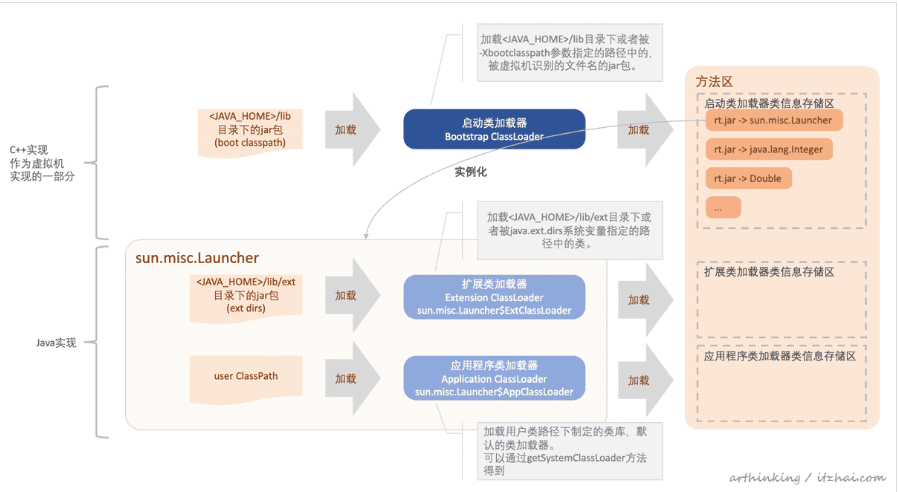

## 一 内存区域
### 1. 什么是jvm 内存区域
   jvm 内存区域指的不是内存模型 是指jvm 程序在运行的时候将管理的内存划分为哪几个区域
   1. 程序计数器 :  是每个线程私有的 在程序进行运算的时候 用这个来计数
   2. 栈内存  : 是每一个线程私有的 是线程在执行方法时的栈帧  当每个方法被调用和结束对应着一个入栈和出栈,内存结构为
                  局部变量表
                  操作数栈
                  动态链接
                  返回地址 
   3. 堆内存  每个对象被创建的话 都是存放在这里的(说的是存放对象的实例) 也是垃圾回收器主要回收的区域  因为 程序计数器 栈内存 都是线程私有的 线程销毁 内存就会被回收
                       jdk 1.7 之后运行时常量池 放在堆中 
   4. 方法区 这里存储的是 对象被创建之后的类信息、静态变量、常量(也就是类运行时的数据结构)
### 2.常量存在的地方(常量池)
   #### 字符串常量池: 
        static String s= "hello"; 因为是静态方法,这是在编译的时候就放进了字符串常量池里面了.
        String s1 = "hello";  然后这个时候放进去 就会出现发现常量池里面有 和上面一样的;
        String s2 = s1 + "2";  只要有变量 那么底层就是使用 Stringbudder 的append 方法 那引用的就不同了.
        String s3 = new String("hello");   new 的对象是在堆中的  引用的是常量池中的  但是这个对象和上面是不同的
        String s4 = s3.intern();    这个是将字符串放进常量池 如果常量池已经有的 返回已有的地址 如果没有 将这个添加进去 返回地址 
   #### 运行时常量池:
   一直在方法区中,JDK1.7之后将常亮常量池从方法区中拿到了堆中 但是运行时常量池还在方法区中
#### 方法区、永久代、matespace 都是啥？
   首先方法区是内存区域中的一个逻辑划分 而永久代和matespace是方法区的一种实现 在JDK1.7和之前的版本 方法区的实现都是永久代
   而JDK1.8 和之后是用matespace 来表示这个方法区 使用的是直接内存

## 二 啥是对象
   我们一直都面向对象开发,我们这里说的对象就是一个类 将一个类加载进内存 并且是怎么存储的.
   
### 1.什么时候创建一个对象
   1. 当使用new、getstatic、putstatic、 也就是被创建或者是被调用类中的静态方法的时候
   2. 当通过反射调用的时候
   3. 当初始化一个类的时候 父类没有初始化的时候 父类会先初始化
   4. 虚拟机启动 main 方法所在的类要初始化
   5. 这个不大清楚 是1.7 动态语言支持的一个啥

### 2. 如何创建一个对象？
   这里创建对象一定要弄清楚步骤 弄清楚哪个是**类的加载**和哪个是**对象的创建**
   
#### 2.1 类加载
   类加载这里主要分为三个阶段
   
#####2.1.1加载 
   这个阶段 感觉就是和硬件打交道的时候 首先把 这个类的二进制流加载进来 然后对二进制流进行验证  看有没有被改变什么的  这个时候已经吧数据(类型信息 字段信息 方法信息)存放在方法区中了(就是转化为运行时数据结构)  
#####2.1.2连接阶段 
   
   1. 验证： 确保class 文件的可信度
   2. 准备： 为类变量（被static 修饰的变量）在方法区中设置变量初始值
   3. 解析： 将常量池中的符号引用替换为直接引用  
#####2.1.3  初始化
   初始化过程是执行类构造器的< clinit>(这个方法是由编译器自动收集所有类变量的赋值动作和
   静态语句块合并产生的)的过程
#### 2.2 分配内存
   类加载完之后 空间就确定了 这一步会分配内存 内存的分配，内存分配的时候要看内存中是否有规整的内存 内存的规整是根据垃圾收集器是什么导致的
   
   
### 1. 类加载机制
   当一个类被编写好 他需要被加载进jvm 这个时候是怎么被加载进来的
    Launcher 下面两个静态内部类   
            AppClassLoader  应用类加载器
            ExtClassLoader  扩展类加载器
   
2.对象的创建.
    当一个对象被new 或者getinstance 或者 加载他的子类等等的时候  会去加载这个类的class 文件  将一个对象创建一般分为三步  
    **加载阶段**:  
    **链接阶段**:  加载进来的文件进行验证 就是看变量有没有引用错 实现抽象接口有没有实现方法 然后为类的**静态变量**设置 零值  并且把常量池内符号引用变成直接引用
    
    **初始化阶段**: 执行构造器的**<clinit>**方法(自动生成的) 对类变量进行初始化 这个时候如果有静态属性和静态代码块 顺序执行给属性赋值
    

疑问: 上面对象的创建和类加载器有啥关系呢？
    对象创建 将数据放进方法区  这个时候方法区中引用对象的实例 是放在堆中的 方法区 雇佣了两个工种帮自己干活  
    类加载器: 各种的类加载器将方法区分为了三块 分别管理， 类的卸载和加载的工作
    class 实例： 如果有人想对这个类进行修改 就要通过这个实例来访问方法区.

3. 对象的内存存储
    对象头:    
        存放的就是类 哈希码  gc年龄 锁的信息 
        类型指针 指向元数据的指针 表明这个是哪个对象的实例 
    实例信息: 各种类型的字段内容
    填充：为了凑够页的大小 占位的作用

疑问：对象的基本信息存在方法区还是堆中？
    不要把对象头的信息 和方法区中的基本信息搞混了  哈希码之类的是在堆中的 基本方法 接口的信息 是在方法区中的

Q: 类是怎么加载的? 为什么要用类加载器? 双亲委派模型是为了解决什么问题?
       双亲委派机制的优势：采用双亲委派模式的是好处是Java类随着它的类加载器一起具备了一种带有优先级的层次关系，通过这种层级关可以避免类的重复加载，当父亲已经加载了该类时，
       就没有必要子ClassLoader再加载一次。其次是考虑到安全因素，java核心api中定义类型不会被随意替换，假设通过网络传递一个名为java.lang.Integer的类，通过双亲委托模式
       传递到启动类加载器，而启动类加载器在核心Java API发现这个名字的类，发现该类已被加载，并不会重新加载网络传递的过来的java.lang.Integer，而直接返回已加载过的Integer.class，
       这样便可以防止核心API库被随意篡改。
    

Q:类是什么时候被加载的？
    我认为如果是jdk 自带的类 是在系统启动的时候由启动类加载器加载 
    ext下面的是由扩展类加载器,
    如果是自己创建的类是在new 的时候或者引用到静态的时候才去获取这个
    类的实例对象 这个时候去看 有没有加载 如果加载了 就会直接返回 没有加载就 双亲 来加载

####Q: Class.forName和class.classload的区别
   Class.forName()  底层调用forName  第二个参数 标识是否需要初始化 默认是true  所以会调用类的静态方法  
   class.classload  底层调用的第二个参数是flase  标识 不需要连接  也就是不需要初始化 不会调用类的静态方法
    

