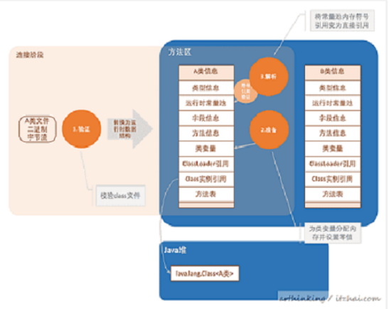

## 一 内存区域
### 1. 什么是jvm 内存区域
   jvm 内存区域指的不是内存模型 是指jvm 程序在运行的时候将管理的内存划分为哪几个区域
   1. 程序计数器 :  是每个线程私有的 在程序进行运算的时候 用这个来计数
   2. 栈内存  : 是每一个线程私有的 是线程在执行方法时的栈帧  当每个方法被调用和结束对应着一个入栈和出栈,内存结构为
                  局部变量表
                  操作数栈
                  动态链接
                  返回地址 
   3. 堆内存  每个对象被创建的话 都是存放在这里的(说的是存放对象的实例) 也是垃圾回收器主要回收的区域  因为 程序计数器 栈内存 都是线程私有的 线程销毁 内存就会被回收
                       jdk 1.7 之后运行时常量池 放在堆中 
   4. 方法区 这里存储的是 对象被创建之后的类信息、静态变量、常量(也就是类运行时的数据结构)
### 2.常量存在的地方(常量池)
#### 字符串常量池: 
        static String s= "hello"; 因为是静态方法,这是在编译的时候就放进了字符串常量池里面了.
        String s1 = "hello";  然后这个时候放进去 就会出现发现常量池里面有 和上面一样的;
        String s2 = s1 + "2";  只要有变量 那么底层就是使用 Stringbudder 的append 方法 那引用的就不同了.
        String s3 = new String("hello");   new 的对象是在堆中的  引用的是常量池中的  但是这个对象和上面是不同的
        String s4 = s3.intern();    这个是将字符串放进常量池 如果常量池已经有的 返回已有的地址 如果没有 将这个添加进去 返回地址 
#### 运行时常量池:
   一直在方法区中,JDK1.7之后将常亮常量池从方法区中拿到了堆中 但是运行时常量池还在方法区中
   
#### 方法区、永久代、matespace 都是啥？
   首先方法区是内存区域中的一个逻辑划分 而永久代和matespace是方法区的一种实现 在JDK1.7和之前的版本 方法区的实现都是永久代
   而JDK1.8 和之后是用matespace 来表示这个方法区 使用的是直接内存

## 二 啥是对象
   我们一直都面向对象开发,我们这里说的对象就是一个类 将一个类加载进内存 并且是怎么存储的.
   
### 1.什么时候创建一个对象
   1. 当使用new、getstatic、putstatic、 也就是被创建或者是被调用类中的静态方法的时候
   2. 当通过反射调用的时候
   3. 当初始化一个类的时候 父类没有初始化的时候 父类会先初始化
   4. 虚拟机启动 main 方法所在的类要初始化
   5. 这个不大清楚 是1.7 动态语言支持的一个啥

### 2. 如何创建一个对象？
   这里创建对象一定要弄清楚步骤 弄清楚哪个是**类的加载**和哪个是**对象的创建**
   
#### 2.1 类加载
   类加载这里主要分为三个阶段
   
#####2.1.1加载 
   这个阶段就是我们所了解的**类加载器加载**的时机,通过一个类的全限定名来获取描述此类的二进制字节流
#####2.1.2连接阶段 
   
   1. 验证： 确保class 文件的可信度
   2. 准备： 为类变量（被static 修饰的变量）在方法区中设置变量初始值
   3. 解析： 将常量池中的符号引用替换为直接引用  
#####2.1.3  初始化
   初始化过程是执行类构造器的< clinit>(这个方法是由编译器自动收集所有类变量的赋值动作和
   静态语句块合并产生的)的过程
#### 2.2 分配内存
   类加载完之后 空间就确定了 这一步会分配内存 内存的分配，内存分配的时候要看内存中是否有规整的内存 内存的规整是根据垃圾收集器是什么导致的
   
#### 2.3 初始化零值
   这个时候内存分配好了就会为这些内存空间初始化零值，如果使用TLAB(Thread Local Allocation Buffer)线程本地分配缓存区 这一工作也可以提前至TLAB分配是进行
#### 2.4 设置对象头
   接下来就要去这个对象进行必要的设置,例如这个对象是哪个类的实例,如何才能找到这个对象的元数据信息，对象的
   哈希码、对象的GC分代年龄 这些信息是放在对象头中的
#### 2.5 执行init 方法
   init方法就是类的构造器 和上面的< clinit> 类加载构造方法不同 下面代码演示区别
   ````java
        class X {
           static Log log = LogFactory.getLog(); // <clinit>
           private int x = 1;   // <init>
           X(){
              // <init>
           }
           static {
              // <clinit>
           }
        }
````

### 3.对象在内存中是咋引用的？
   经过上面的一系列加载 一个类就创建出来了 在内存中也就有了一席之地了,然后在方法栈中 reference 引用堆中的这个对象，根据定位这个对象的不同方式可以分为两种
   * 如果使用了句柄访问的话 java堆中有一部分作为句柄池,reference 存的是句柄的地址 在对象经过垃圾收集频繁移动的话 这个地址不需要变化
   
   * 如果使用直接指针访问 在创建对象的时候就要考虑防止类型数据的指针  这个好处是 速度更快 少了一次指针定位的开销 
   
   
### 4. 疑问
#### Q:类加载时机的第一步加载时怎么加载的(双亲委派机制)？
   所有类的加载第一步都是将类加载进内存,有以下几种类加载器
   
   * bootstrap classLoad系统类加载器: 是C++ 实现的 用来加载 lib 目录下面的类
   * AppClassLoader  应用类加载器 : 加载 lib\ext 目录中的 
   * ExtClassLoader  扩展类加载器 ： 用来加载用户类路径上指定的类库
   * 自定义类加载器: 自定义一个类继承 java.lang.ClassLoader,重写它的findClass方法。
   
   双亲委派模型要求除了顶层的启动类加载器外，其余的类加载器都应当有自己的父类加载器.  
   双亲委派机制的优势：采用双亲委派模式的是好处是Java类随着它的类加载器一起具备了一种带有优先级的层次关系，通过这种层级关可以避免类的重复加载，当父亲已经加载了该类时，
          就没有必要子ClassLoader再加载一次。其次是考虑到安全因素，java核心api中定义类型不会被随意替换，假设通过网络传递一个名为java.lang.Integer的类，通过双亲委托模式
          传递到启动类加载器，而启动类加载器在核心Java API发现这个名字的类，发现该类已被加载，并不会重新加载网络传递的过来的java.lang.Integer，而直接返回已加载过的Integer.class，
          这样便可以防止核心API库被随意篡改。
          
#### Q:我们可以破坏双亲委派模型吗？
   当然可以 双亲委派模型不是强制性的约束模型, 我们的自定义类加载器只要重写它的  classLoad()方法 就会执行到这个，注意正常是重写findClass();
   
#### Q:对象的内存布局是咋样的？
   在内存中存储的布局可以分为三部分
   * 对象头: 分为两个部分
        * Mark World: 对象运行的数据 哈希码、GC分代年龄、锁标志、线程持有的锁、偏向锁id偏向时间戳 
        64位占据64bit。
        * 类型指针： 这个部分不是一定要有的，取决于对象栈访问内存中的引用 
        如果是直接引用的话 这个就是要在堆中指向方法区中的对象类型数据。
   * 实例数据: 代码中定义的各种类型的字段内容(包括继承父类的)
   * 空白填充：就是占位符 如果上面的数据正好是8的整数倍 那这个就没有,不然这个就填充.
   
#### Q: Class.forName和class.classload的区别
   Class.forName()  底层调用forName  第二个参数 标识是否需要初始化 默认是true  所以会调用类的静态方法  
   class.classload  底层调用的第二个参数是flase  标识 不需要连接  也就是不需要初始化 不会调用类的静态方法
    


#### Q: for循环的时候怎么删除其中的元素
   不能再foreach中去除  可以用迭代器 获取fori


## 内存管理工具
   ### 在windows中 使用 jconsle
   在jdk 的目录中 直接打开 然后选中运行的java 就可以了 
   
   ### 在命令行中 
   命令生成一个堆内存快照放到一个二进制文件中去  
   jmap -dump:live,format=b,file=dump.hprof PID
   
   按照各种对象占用内存空间的大小降序排列，吧占用内存最多的对象放在最上面  
   jmap -histo PID  
     


