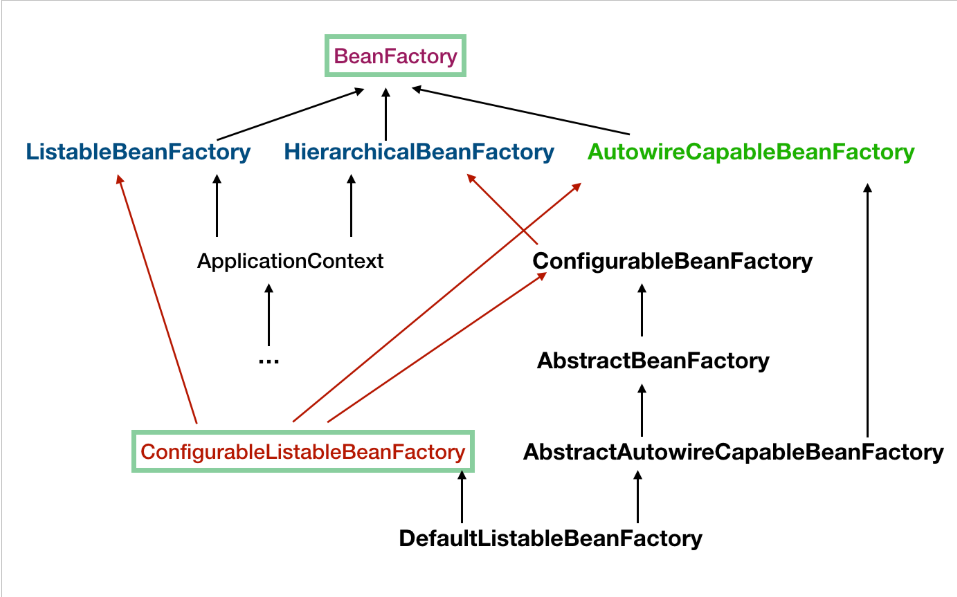
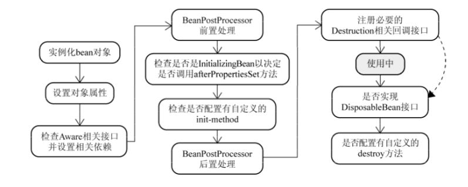

Q: 为什么要用spring  他给我们带来了什么好处？
    在java 的基础开发中 我们自己new 出来对象 然后管理他的生命周期, 
    ioc : 而spring 提供的ioc 容器让我们不用管对象的创建和对象的生命周期 这些都交给spring来管理 spring 有自己定义的类加载器来加载类
    Di(依赖注入)： 当两个类相互依赖  由于都是交给spring 管理 这个时候直接引用就行了   比如要实例化一个service 里面用@Aotowari 注解或者 @Resouece 引入了别的实例 这种属性注入

### 源码分析:
  首先需要明白类的加载关系,
  
  spring是通过反射用类加载器加载xml中配置的bean的
  

```java
@Override
public void refresh() throws BeansException, IllegalStateException {
   // 来个锁，不然 refresh() 还没结束，你又来个启动或销毁容器的操作，那不就乱套了嘛
   synchronized (this.startupShutdownMonitor) {

      // 准备工作，记录下容器的启动时间、标记“已启动”状态、处理配置文件中的占位符
      prepareRefresh();

      // 这步比较关键，这步完成后，配置文件就会解析成一个个 Bean 定义，注册到 BeanFactory 中，
      // 当然，这里说的 Bean 还没有初始化，只是配置信息都提取出来了，
      // 注册也只是将这些信息都保存到了注册中心(说到底核心是一个 beanName-> beanDefinition 的 map)
      ConfigurableListableBeanFactory beanFactory = obtainFreshBeanFactory();

      // 设置 BeanFactory 的类加载器，添加几个 BeanPostProcessor，手动注册几个特殊的 bean
      prepareBeanFactory(beanFactory);

      try {
         // 【这里需要知道 BeanFactoryPostProcessor 这个知识点，Bean 如果实现了此接口，
         // 那么在容器初始化以后，Spring 会负责调用里面的 postProcessBeanFactory 方法。】

         // 这里是提供给子类的扩展点，到这里的时候，所有的 Bean 都加载、注册完成了，但是都还没有初始化
         // 具体的子类可以在这步的时候添加一些特殊的 BeanFactoryPostProcessor 的实现类或做点什么事
         postProcessBeanFactory(beanFactory);
         // 调用 BeanFactoryPostProcessor 各个实现类的 postProcessBeanFactory(factory) 回调方法
         invokeBeanFactoryPostProcessors(beanFactory);          


         // 注册 BeanPostProcessor 的实现类，注意看和 BeanFactoryPostProcessor 的区别
         // 此接口两个方法: postProcessBeforeInitialization 和 postProcessAfterInitialization
         // 两个方法分别在 Bean 初始化之前和初始化之后得到执行。这里仅仅是注册，之后会看到回调这两方法的时机
         registerBeanPostProcessors(beanFactory);

         // 初始化当前 ApplicationContext 的 MessageSource，国际化这里就不展开说了，不然没完没了了
         initMessageSource();

         // 初始化当前 ApplicationContext 的事件广播器，这里也不展开了
         initApplicationEventMulticaster();

         // 从方法名就可以知道，典型的模板方法(钩子方法)，不展开说
         // 具体的子类可以在这里初始化一些特殊的 Bean（在初始化 singleton beans 之前）
         onRefresh();

         // 注册事件监听器，监听器需要实现 ApplicationListener 接口。这也不是我们的重点，过
         registerListeners();

         // 重点，重点，重点
         // 初始化所有的 singleton beans
         //（lazy-init 的除外）
         finishBeanFactoryInitialization(beanFactory);

         // 最后，广播事件，ApplicationContext 初始化完成，不展开
         finishRefresh();
      }

      catch (BeansException ex) {
         if (logger.isWarnEnabled()) {
            logger.warn("Exception encountered during context initialization - " +
                  "cancelling refresh attempt: " + ex);
         }

         // Destroy already created singletons to avoid dangling resources.
         // 销毁已经初始化的 singleton 的 Beans，以免有些 bean 会一直占用资源
         destroyBeans();

         // Reset 'active' flag.
         cancelRefresh(ex);

         // 把异常往外抛
         throw ex;
      }

      finally {
         // Reset common introspection caches in Spring's core, since we
         // might not ever need metadata for singleton beans anymore...
         resetCommonCaches();
      }
   }
}
```

## spring生命周期
   
  首先会设置beanFactory 将所有的bean 放在这个里面, 容器说到底就是一个map  name -> bean  然后设置类加载器 看bean是否实现了一些类 然后执行这些方法 然后将类进行初始化 
  
Q: 首先的疑问是 bean 实现了 一些接口 在调用这些接口的时候 这些bean的属性有没有被加在的  属性是在什么时候加载的?

总结: 使用spring 的时候 用到的就是啥都不用管 都交给spring 来管理(spring 的初始化 bean 容器的管理) 


### AOP 面向切面编程: 使用动态代理对方法进行增强
   当对一系列(有特征的)方法进行统一处理,spring 的aop 是基于动态代理的 如果是对有接口的 是使用JDK Proxy进行代理的
   如果是没有实现接口的 那么就无法使用JDK Proxy进行代理了 这个时候就使用 cglib生成一个被代理的子类进行代理


# spring mvc 

   spring mvc 
   1.请求到达 dispatchServlet, 调用HandlerMapper 解析对应的handler 
   2.解析到了handler 也就是常说的controller 控制器 然后交给 handlerAdepter适配器处理
   3.handleradepter 会根据 handler 调用(.handler方法)对应的处理器来处理请求 返回一个mv(modelandview)
   


### Q: 为什么请求会执行到DispatchServlet 的doDispatch?
   首先 看继承链 可以看到 最上面是继承 servlet 肯定会执行他的service 而 FrameworkServlet 的service 实现了 执行  processRequest 然后看到doService DispatchServelet 实现了  
   这个方法里面是  doDispatch 这就到这个方法了 

###Q: 什么是 handlerMapping 和 HandlerAdapter 有啥用？
   

### Q: handlerMapping 的实现方式,最常用的是哪种?
   断点可以看到 有五种实现方式 最常用的是 RequestMappingHandlerMapping 这个就是我们常用的@RequestMapping 注解注册的mapping 

### Q: HandlerAdapter 有几种 常用的是哪一种？
   断点可以看到有三种  常用的是RequestMappingHandlerAdapter  就是加@Controller 这个注解的

### Q: HandlerAdapter和 handlerMapping 什么时候初始化的？
   首先继承链中 继承servlet 肯定会先执行 init 方法 跟踪可得 执行FrameworkServlet类的 initServletBean 方法 最后进行初始化 ioc 容器


### Q: spring 中 A(没有事务)调用 B(有事务) 同类中 B 的事务生效吗 如果不生效 为什么？
   不生效 事务的本质是代理 是调用的时候对这个类的方法 进行 aop 增强 如果是同类调用 没法 用代理  所以事务不生效
   原理大概就是 调用这个方法前 开启mysql 事务 start TRANSACTION 之后 commit 或者 roback   

### Q: 分布式事务的实现方式?
   分布式事务 可以用 seata 比较耗费性能  还可以补偿机制 工单的   还可以 mq?
   seata 是两阶段提交协议的实现 阿里巴巴的 主要是一个事务管理器在协调每个事务 
        1.准备阶段  事务管理器给每个参与者发送消息 每个事务在本地 执行事务 并写本地的undo/redo 日志 这个时候事务没有提交
        2.提交阶段 如果事务管理器收到了 事务的失败或者超时消息 给每个参与者发送回滚消息 


