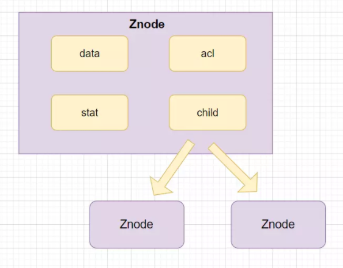
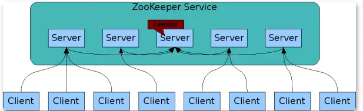

> 人生舞台的大幕随时都可以拉开，关键是你愿意表演还是躲避。


### 一、啥是zk？
   zookeeper是为**分布式系统提供一致性服务**的软件，也是**分布式协调服务**，本身也是分布式的 采用了主从架构保证集群的稳定性  
   在分布式系统中，多个机器之间的管理，master 的选举 起到了管理员的功能  
   zk = 文件系统 + 监听通知机制
   
   #### 1.1 提供了什么服务？
   * 注册中心（集群管理）： zk维护一个服务列表 和接口列表, 当有机器挂了，该机器与zk断开连接，对应的临时目录也会删除 其他的也就能监听到
   * 保证一致性（命名服务）： 基本上的服务只是为了保证分布式系统访问同一资源的一致性 是基于zk的路径名是全局一致的
   * 配置管理： 这个是基于监听机制的，将配置保存在这个里面 当发生变化的时候 会通知 订阅者
   
### 二、zk的原理是啥？
   就是维护一个全局不可重复的路径,并且通过监听watch向监听者发送通知
   
   #### 2.1 文件路径标识（Znode）
   维护的每一个全局唯一的节点,又叫做znode 可以通过路径来标识, 这种节点有四种类型 分别是
   * 持久节点：这种节点创建之后除非被删除 不然不会消失
   * 持久顺序节点： 这个节点和上面的相比，这个父节点在创建的时候维护一个自增性数字，用于子节点创建的顺序
   * 临时节点： 这个的生命周期和会话绑定，一旦连接断开这个就被删除， 规定 临时节点只能作为叶子节点
   * 临时顺序节点： 这个和上一个相比就是增加了有序性
   
   #### 2.2 znode 里面存储了什么
   主要就是存储了 数据、访问权限、子节点引用、节点状态信息，里面存储数据越小越好,最好不要超过1M
   
   
   #### 2.3 watch 监听机制
   每一个客户端可以向znode 注册监听，这样每次这个znode 节点变化就会通知，其工作原理如下  
   
   1. 客户端向ZooKeeper服务器注册Watcher的同时，会将Watcher对象存储在客户端的WatchManager中。
   2. 当zookeeper服务器触发watcher事件后，会向客户端发送通知， 客户端线程从 WatcherManager 中取出对应的 Watcher 对象来执行回调逻辑。
   
### 三、zk集群中的角色
   单机的zk并不能保证高可用性，这个时候就需要搭建集群，而搭建集群就涉及cap 在cp和ap之间做选择的话 其实是要求强一致性，也就是cp
   
   是当集群中的信息还没完成同步 不对外提供服务， 而zk能把这个同步的时间压缩到很小 所以这方面很优秀
   
   集群中 zk 的宏观结构
     
   
   其中的角色有 Leader(管理者), Follower (跟随者), Observer (观察者)  
   1. Leader 是 集群的核心
        * 事务请求的唯一调度和处理者，保证集群处理事务的顺序性
        * 内部各服务的调度者
   2. Follower 集群状态的跟随者
       * 处理客户端非事务请求，转发事务请求给Leader服务器
       * 参与事务请求Proposal的投票
       * 参与Leader选举投票
   3. Observer 3.3.0 之后引入的 观察ZooKeeper集群的最新状态变化并将这些状态变更同步过来
        * 处理客户端的非事务请求，转发事务请求给 Leader 服务器
        * 不参与任何形式的投票
    
   #### 3.1 服务器的状态
   在集群中服务器的状态有四种状态，分别是 LOOKING、FOLLOWING、LEADING、OBSERVING。
   * LOOKING：寻找Leader状态。当服务器处于该状态时，它会认为当前集群中没有 Leader，因此需要进入 Leader 选举状态。
   * FOLLOWING：跟随者状态。表明当前服务器角色是Follower。
   * LEADING：领导者状态。表明当前服务器角色是Leader。
   * OBSERVING：观察者状态。表明当前服务器角色是Observer。

   #### 3.2 Leader 挂掉了之后 怎么进行选举的
   
   
   
   

### 四、zk作为分布式锁的实现原理
   分布式锁其实是通过临时节点和watch监听实现的，   
   当客户端过来的时候会创建一个永久节点 /locks 然后在这个节点下面创建临时顺序子节点
   
   
   这个时候客户端二过来了 也会在这个永久节点下创建临时顺序节点 它会判断自己是不是第一个，如果是 就获取锁   
   如果不是那就注册监听他的前一个节点，后面以此类推
   
   
   这样后面在过来注册的就会连成一个链表,当第一个释放或者断开的时候,会将自己的临时节点删除，后面那个监听的就会感知到前面删除 就会获得锁了 
   
   

### 五、部署
   #### 5.1 linux 部署
   ```text
    wget http://archive.apache.org/dist/zookeeper/zookeeper-3.4.12/zookeeper-3.4.12.tar.gz
    tar -zxvf zookeeper-3.4.12.tar.gz
    # 重命名配置文件zoo_sample.cfg
    cp conf/zoo_sample.cfg conf/zoo.cfg
    # 启动
    bin/zkServer.sh start
    # 连接本地
    bin/zkCli.sh

    # 在终端操作命令
    # 查看当前有什么数据文件
    ls  /
    # 创建一个新的znode 包含字符串 myData
    create /zkPro myData
    
    # 查看znode的数据
    get /zkPro
    # 更新 znode 的数据
    set /zkPro myData
    # 删除 znode 的数据
    delete /zkPro 
```

   #### 5.2、 java连接使用
   引入依赖
   ```text
        <dependency>
            <groupId>org.apache.zookeeper</groupId>
            <artifactId>zookeeper</artifactId>
            <version>3.4.12</version>
        </dependency>
```
    
   引入代码 监听变化
   ```java
        import java.util.concurrent.CountDownLatch;
        import org.apache.zookeeper.WatchedEvent;
        import org.apache.zookeeper.Watcher;
        import org.apache.zookeeper.Watcher.Event.EventType;
        import org.apache.zookeeper.Watcher.Event.KeeperState;
        import org.apache.zookeeper.ZooKeeper;
        import org.apache.zookeeper.data.Stat;
        
        /**
        * 分布式配置中心demo
        * @author 
        *
        */
        public class ZooKeeperProSync implements Watcher {
        
        private static CountDownLatch connectedSemaphore = new CountDownLatch(1);
        private static ZooKeeper zk = null;
        private static Stat stat = new Stat();
        
        public static void main(String[] args) throws Exception {
            //zookeeper配置数据存放路径
            String path = "/username";
            //连接zookeeper并且注册一个默认的监听器
            zk = new ZooKeeper("192.168.31.100:2181", 5000, //
                    new ZooKeeperProSync());
            //等待zk连接成功的通知
            connectedSemaphore.await();
            //获取path目录节点的配置数据，并注册默认的监听器
            System.out.println(new String(zk.getData(path, true, stat)));
        
            Thread.sleep(Integer.MAX_VALUE);
        }
        
        public void process(WatchedEvent event) {
            if (KeeperState.SyncConnected == event.getState()) {  //zk连接成功通知事件
                if (EventType.None == event.getType() && null == event.getPath()) {
                    connectedSemaphore.countDown();
                } else if (event.getType() == EventType.NodeDataChanged) {  //zk目录节点数据变化通知事件
                    try {
                        System.out.println("配置已修改，新值为：" + new String(zk.getData(event.getPath(), true, stat)));
                    } catch (Exception e) {
                    }
                }
            }
        }
        }
``` 


参考博客： https://my.oschina.net/u/4138213/blog/4549935
https://zhuanlan.zhihu.com/p/69114539

