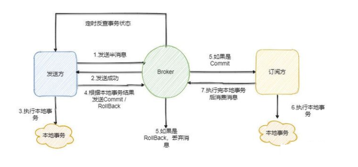
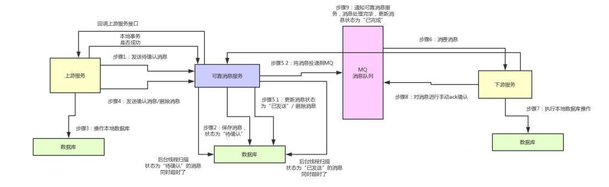
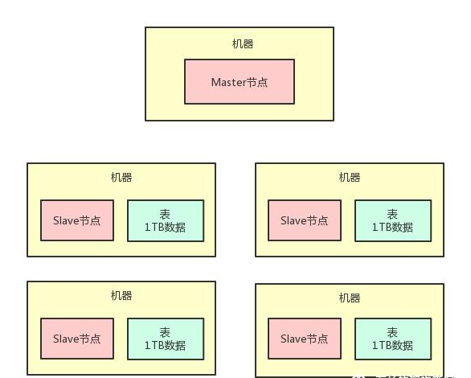
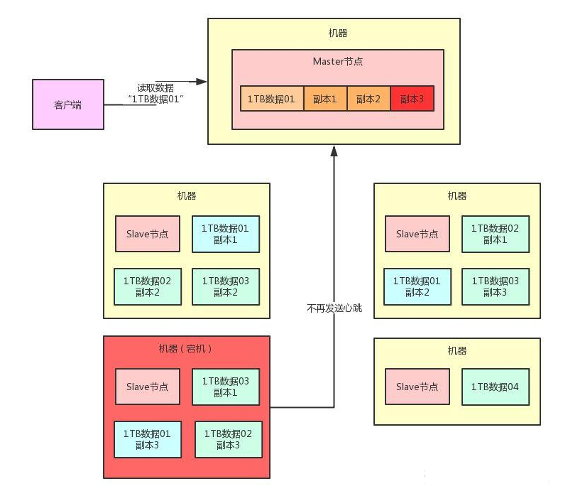

#### 一、前言
   分布式在现在系统中可以说是非常常见了,相比较传统的单机而言，分布式采用多台机器 将风险给平摊，将计算和存储都分摊，技术实现难度较高
   但也是不得不走的必要路程  
   
   对于一个技术分布在不同的机器上，他们之间的相互交互就涉及到分布式方案
   
#### 二、分布式事务
  分布式事务一般都是用在 一个系统调用其他的几个系统, 而且他们都是要么全部成功，要么全部失败 将他们作为一个整体来看
     
   
   作为分布式事务的实现方案都是为了保证一致性的，从这个上面可以划分成两个方向-- **强一致性**和**最终一致性**
  
   #### 2.1 2pc 两阶段提交 - 强一致性
   两阶段提交的原理是 引入一个**事务协调者**的概念来管理各个系统的事务，是一个**同步阻塞协议**，分为两个阶段
   
   * 准备阶段：当一个事务开始的时候,协调者会向各个服务发送准备请求 ，等待其他的返回准备成功,如果都成功了 就走第二步
   * 提交阶段： 当所有的都返回完成了，这个时候是提交事务 还是回滚事务 这个时候就通知其他的
   
   在2pc 的时候最需要注意的就是 网络延迟的问题 对于协调者来说 网络延迟没有相应就是失败了, 对于被管理者来说 发送了网络延迟没有相应就是成功了  
   对于2pc来说  第二阶段的提交阶段 可能被接受者没有接收到 那他就处于阻塞状态
   
   #### 2.2 3pc 三阶段提交  - 强一致性
   相对比两阶段提交的第二个阶段做了拆分,将 提交阶段分为了预提交阶段和提交阶段 在预提交阶段对所有的服务做了状态的同步
   
   #### 2.3 TCC - 最终一致性
   TCC 是业务层面的补偿方式  是**强耦合**的,基本上用于**同步调用**。 因为业务上事务的回滚也能不止是数据库层面上的 还有发送短信之类的 TCC(Try - Confirm - Cancel)
   * try: 资源的**预留**与锁定。 这个预留比较重要 是自己实现的 比如订单支付自己定义一个中间状态 预支付 库存是 冻结库存
   * confirm：确认操作 这一步就是执行了， 是自己实现的 上面预留都成功了 比如在将订单支付 变为成功 短信真正发送出去这样
   * cancel： 撤销操作, 就是将预留的步骤给撤销 这一步自己实现 但是实在框架的调用下执行 比如服务宕机了  这个将所有状态变回去
   
   是需要在业务上自己实现上面的三个操作，预留和确认和撤销操作，完全耦合在业务上的  
   但是还是需要引入框架来执行流程的 常用的有  ByteTCC、himly、tcc-transaction。
   
   #### 2.4 本地消息表 - 最终一致性
   是利用各系统**本地事务来实现**的最终一致性，具体步骤是  
   1. 将本地的事务和写入本地消息表的操作放在一个事务里，如果写入成功就说明事务成功了  
   2. 在下一步的系统中定时去看这个表中的状态不是已完成的，就去执行 然后将表中的状态改为完成
   
   #### 2.5 消息一致性 -  最终一致性
   消息是异步的， 只能保证第一个系统失败 所有都失败 第一个系统成功,第二个一定要成功  
   消息的一致性，其实就是保证 发送者成功了一定会发送到消息队列中，消费者将消息队列拿掉一定会执行成功.
   但是有一点，如果 A 事务成功 发送到 MQ,B如果执行失败了,A是不会回滚的,只会一直尝试执行 知道吧消息消费掉
   
   
   
   首先上面的需要mq支持事务消息，即发送事务消息prepare，事务发送后commit，如果mq不支持的话那么可以自己实现一个中间消息服务
   
   
  
   #### 2.6 补偿工单 - 最终一致性
   补偿工单的形式  只是在事务都提交之后了 事后去吧这个事务给弥补了
   
   #### 2.7 seata 的实现
   [参考](http://blog.itpub.net/69912579/viewspace-2739922/)  
   有三个核心组件
   * Transaction Coordinator(TC，事务协调器)—— 维护全局事务和分支事务的状态，驱动全局事务提交或回滚。
   * Transaction Manager(TM，事务管理器) —— 定义全局事务的范围，开始事务、提交事务、回滚事务。
   * Resource Manager(RM，资源管理器)：—— 管理分支事务上的资源，向TC注册分支事务，汇报分支事务状态，驱动分支事务的提交或回滚。
   
   四个工作模式
   * AT（Auto Transaction）
   * TCC
   *  XA模式
   * 
   seata 是两阶段提交协议的实现 阿里巴巴的 主要是一个事务管理器在协调每个事务 
   1. 准备阶段  事务管理器给每个参与者发送消息 每个事务在本地 执行事务 并写本地的undo/redo 日志 这个时候事务没有提交
   2. 提交阶段 如果事务管理器收到了 事务的失败或者超时消息 给每个参与者发送回滚消息 
     
     

### 三、分布式存储
   当你有一个几十TB级别的文件, 在一台机器上面放不下的时候,这个时候存储就需要很多机器分片来存储这个数据了，这里就涉及分布式存储了  
   
   分布式存储肯定还涉及到很多机器的管理,对于管理分布式存储数据的一套系统 就是分布式存储系统，一般包括master(对外提供服务的)，slave(从属节点)，
   心跳机制(保证挂掉了之后master知道)
   
     
   
   当某一个机器挂了应该怎么办？ 采用 master多机器负载均衡,slave 保存别的节点的副本的方式 
   
     
   
### 四、分布式搜索引擎
   说到搜索引擎不得不说**倒排索引表**,以前是
   ``` text
           静夜思
    床前明月光，疑是地上霜。
    举头望明月，低头思故乡。

            望月怀远
    海上生明月，天涯共此时。
    情人怨遥夜，竟夕起相思。
    灭烛怜光满，披衣觉露滋。
    不堪盈手赠，还寝梦佳期。
    
   ```

   现在是
   ```text
   明月       静夜思,望月怀远
   地上       静夜思
   情人       望月怀远
```
   
   而分布式搜索引擎和分布式存储差不多,将一个机器的数据分片存储在别的机器上 并进行分片冗余，
   
### 五、分布式计算
    
      