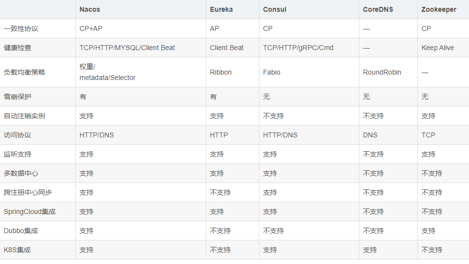

### 什么是分布式 为什么要用分布式?
   最之前是一个服务器上面写了好多代码  这个时候没有解耦 mvc 分层 当业务量大了的时候 这个时候就可以将这个服务进行拆分  说这个的话 吧每个功能单独放在一个服务器上面 每个功能都是一个服务
   当将一个服务拆分成很多个服务的时候  这些服务相互之间调用 和交互  就是分布式了,除了**解耦**这个原因还有就是**单机的性能**是有瓶颈的 如果业务量起来之后 还是需要分布式才能扛得住高并发.
   
   还有就是当开发团队人数超过十人的时候,大家对一个单体应用进行开发,在对代码进行合并的时候,解决冲突很麻烦,然后回归测试很耗费时间  
   如果同时开发几个版本,那么测试服务器就要有很多个,不然就要等别人测试完成之后你的才能测  
   在一个系统中用了很多个技术,你将这个技术升级或者什么的 不能保证别人依赖的没有问题。  
   
   微服务架构解决的其实就是很多人维护一个服务的痛点.
   
### http 和 rpc 区别
   http 是网络通信,对外暴露的接口是http 接口可能超时,而且体积更大，但是适合暴露给浏览器或者第三方调用  
   rpc 是可以基于TCP或者HTTP调用，报文更小  
   
   如果是内部调用的话,推荐使用RPC，传输效率高 服务治理方便。如果是对外提供 推荐使用HTTP,因为浏览器 第三方调用方便。
   
   那feign是http调用吗？  
   其实rpc 是远程过程调用 像调用本地一样调用远程代码 feign 也是rpc调用, feign的原理其实是和一个服务的tomcat  将http请求发送过去 但是它通过gzip将请求体给压缩了
   
   
   #### double rpc 和 feign rpc选型  grpc
   feign 是一个基于http的轻量级的框架 性能比较一般般    
   double 自己定义了一整套rpc 框架，是一个比较重的框架 但是自己通过tcp 自己实现了一套协议 效率比较高  
   grpc 是谷歌开源的 应用在跨语言的调用 可以是python 和java 之间的调用 
   
   
### 什么是CAP 在分布式系统中的作用
   首先应该明确CAP指的不是一整个分布式,而是分布式中的每一个角色,比如注册中心的CAP、某个服务的CAP，也可以是redis 的集群分布式等等。
   先谈P : 叫做分区容忍型 有这个的前提再谈 CA 因为不存在这个  那就是单机 那CA 是一定可以实现的  这个是指分布式的系统中  系统应该能持续提供服务，即使系统内部有消息丢失
   C(consistent) ： 一致性  在同一时刻是同样的值 这里要求的就是强一致性
   A(available) : 可用性 在 任何时候请求这个都能得到响应 无论成功和失败 
   
### 服务的管理  注册中心  eueake or zookeeper  or nacos 
   
   注册中心嘛 肯定是拥有以下几个特定的功能:
   * 服务注册   所有的服务都能注册到 这个注册中心去
   * 服务发现   所有注册到这个中心的服务可以发现其他注册的服务
   * 动态管理   如果服务节点不可用了 注册中心知道你不可用了 会将你剔除 服务会有一个续约的请求保证服务的可用。
   
   首先要保证CAP 分布式里面至少应该保证分区容忍性 一个节点挂掉了 应保持服务的可用 然后就是在一致性和可用性之间的权衡.
   * Eureka 因为没有主从之分 是没有master的所有的节点上面都是一样的数据,当触发自我保护的时候就不会剔除服务 即使他可能是不可用的  所以他的**AP**的,即使服务挂了 也能拿到本地缓存的数据。
   * ZooKeeper  如果是在进行选主 或者一半以上的服务不可用 那么将无法获得数据 不是高可用的 所以他是**CP**的 保证了强一致性。
   * nacos  支持CP+AP切换 也支持k8s的集成.

### 服务网关 
   为什么要有网关,因为所有的微服务不能直接暴露给前端调用 在这个前面是有个网关的
   * 屏蔽后面的服务 增加安全性
   * 可以做公共的服务比如 鉴权、过滤恶意请求、限流等等
   
   如果使用了spring 开发其他框架 推荐使用 getway 它使用了流式编程 可以有更高的并发.
   对于小型微服务或者还有其他非spring cloud 节点的微服务 也可以使用zuul 作为网关.

### 服务之间的调用 openFeign 
   服务之间 当然可以直接使用 原生的 http 请求 但是这个会使用非常简单 和注册中心搭配起来 可以从注册中心拉下来集群 用算法(轮询算法 随机算法等) 选中调用的服务

### 分布式事务的实现方式?
   
### 高并发
   首先这里的并发指的是处理前端过来的请求较多 并发较高.实现的技术较多的是以下几种
   * 消息队列
   * 读写分离: 当高并发到来的时候数据库的压力就比较大了,而且大多数都是读多写少,所以这种情况都是 一个主库挂多个从库 写在主库 然后同步数据到从库的
   * 分库分表   指的是当数据量过大 导致数据库性能比较慢
   * 负载均衡   指的是多个用户请求 被分配到不同的服务器或者网站 以提高访问
        * DNS 负载均衡 ：一般用来实现地理级别的均衡。
        * 硬件负载均衡 ： 通过单独的硬件设备比如 F5 来实现负载均衡功能（硬件的价格一般很贵）。
        * 软件负载均衡 ：通过负载均衡软件比如 Nginx 来实现负载均衡功能。  
   
### 高可用
   这里指的是请求到达了服务器 各个服务之间的调用实现的高可用 目前都有对应的技术来实现
   * 降级
   * 集群
   * 熔断
   * 限流
   * 排队
   
   
### 微服务会带来的技术问题
   分布式事务  
   分布式限流，降级  
   分布式配置中心  
   分布式注册中心  
   分布式监控中心  分布式链路监控  
   分布式日志中心  
   分布式网关  安全认证、限流    
   分布式搜索引擎  
     
     
   
   
   
   