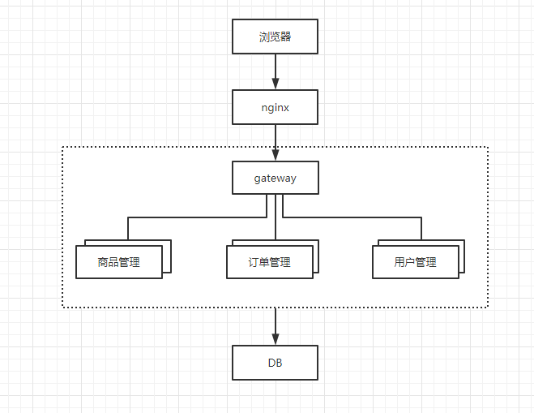
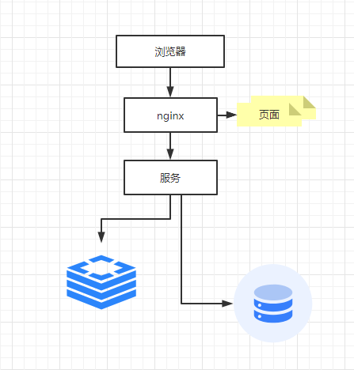
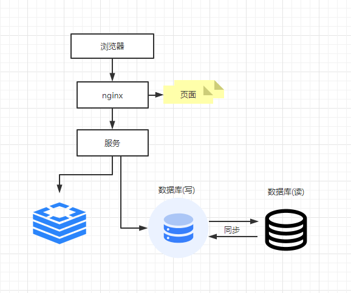
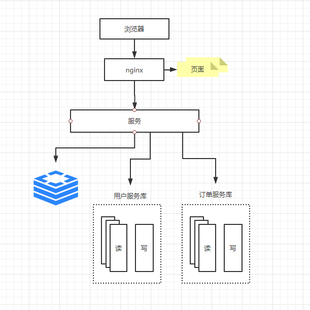
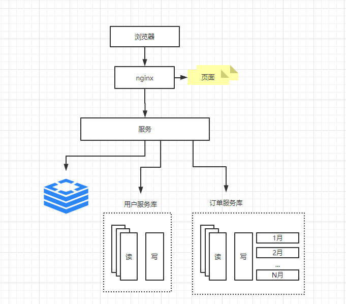

* Nginx 支持最高并发 3w
* tomcat最大连接数200
* mysql最大默认连接数是100

### 一、开篇
   在所有的系统中 都会有系统的开始和中期,除非是一开始就将所有的都考虑好,不然的话都会经历一个从单体结构到集群到分布式的这样
   一个步骤的,这里抄了一篇讲的很好的 原文 https://segmentfault.com/a/1190000018626163  
   每一个技术的出现都是为了去解决瓶颈或者说是痛点的,要将这个技术应用到对应的场景上去,如果你现在没有了解到这个技术的场景,盲目用这个技术是不对的  
   
   #### 1.1、微服务架构方案
   当进行微服务拆分的时候原则是根据是: 通过加机器就可以解决容量和可用性问题。  
   在云概念普及的今天,这个理念非常适用  
     
   * X轴 水平扩展： 通过绝对平等的复制服务与数据,解决容量和可用性的问题,也就是**将微服务运行多个实例,做集群加负载均衡的模式**
   * Y轴 功能扩展: 将庞大的整体应用拆分成多个服务,每个服务实现一组的功能
   * Z轴 数据分片: 这个基本上说的是数据库进行分表拆分之类的

### 二、三种区域的架构
#### 2.1、nginx架构
   这个是请求过来的第一层,当请求数大于默认的3w 就会存在请求太多了处理不过来的情况 这个时候架构就需要升级了  
      
    由于瓶颈在Nginx，因此无法通过两层的Nginx来实现多个Nginx的负载均衡。图中的LVS和F5是工作在网络第四层的负载均衡解决方案，
    其中LVS是软件，运行在操作系统内核态，可对TCP请求或更高层级的网络协议进行转发，因此支持的协议更丰富，并且性能也远高于Nginx，
    可假设单机的LVS可支持几十万个并发的请求转发；F5是一种负载均衡硬件，与LVS提供的能力类似，性能比LVS更高，但价格昂贵。
    由于LVS是单机版的软件，若LVS所在服务器宕机则会导致整个后端系统都无法访问，因此需要有备用节点。可使用keepalived软件模拟出虚拟IP，
    然后把虚拟IP绑定到多台LVS服务器上，浏览器访问虚拟IP时，会被路由器重定向到真实的LVS服务器，当主LVS服务器宕机时，
    keepalived软件会自动更新路由器中的路由表，把虚拟IP重定向到另外一台正常的LVS服务器，从而达到LVS服务器高可用的效果。  
    
     
   **当并发达到几十万的时候,单机LVS也无法支持,由于用户在各地就可以用DNS轮询实现机房的负载均衡**
   
#### 2.2、服务架构
   当请求经过了nginx到达了业务层,这个时候就要考虑,tomcat 能承受的并发会不会被打穿,所以我们最开始的单体结构是不能支持大批量的请求的,首先我们需要知道的是单体架构对后面的提升会有那几方面的问题.
   * 代码可维护性: 所有的应用都放在一个单体上,代码都写在一起,不好扩展
   * 更高的可用性: 将风险平摊到了每一个服务上,如果一个服务挂掉了 不会影响整体的系统,只是一个服务不可用
   * 监控方便: 方便的对每个应用进行监控,可以很容易的定位问题在哪里
   
     
   这种方式可以根据服务拆分出来很多的服务,这样每个服务各司其职,可以用现在比较流行的服务治理框架 double 和 springCloud
   
   
#### 2.3、数据架构
   当请求从应用那边请求到数据库了,这边是以常见的mysql数据库进行举例,当超过mysql最大连接数了怎么办
   
   ##### 2.3.1 本地缓存和分布式缓存
     
   这个时候可以使用 Thymeleaf 来做页面静态化将热点数据页面缓存起来放在nginx中,还可以将热点数据放在redis中,不过放在redis中就要考虑缓存穿透，击穿之类的问题,
   > 随着用户数的增长，并发读写数据库成为瓶颈
    
   ##### 2.3.2 数据库读写分离
     
   将数据库划分为读库和写库,读库可以有多个,通过Mycat 来组织同步机制将数据同步写到读库中,也可以往缓存中写一份
   > 业务量变多的话,不同业务之间的访问量是不同的,不同业务竞争数据库,互相影响性能
    
   ##### 2.3.3 按业务分库
     
   对于不同的业务分成不同的库这样 如果访问量大的库可以直接部署多台机器,这样做有一个缺点,不同库的表无法做关联查询(跨库join，分布式事务等)
   > 当数据增多一个表放不下这些数据,或者数据查询非常慢怎么办

   ##### 2.3.4 大表拆小表
     
   数据库分表可以考虑根据业务分 还是根据时间分 还是根据用户分(如果to b,每个业务都很多的话),
   比如针对评论数据，可按照商品ID进行hash，路由到对应的表中存储；针对支付记录，可按照小时创建表，
   每个小时表继续拆分为小表，使用用户ID或记录编号来路由数据。只要实时操作的表数据量足够小，
   请求能够足够均匀的分发到多台服务器上的小表，那数据库就能通过水平扩展的方式来提高性能。
   其中前面提到的Mycat也支持在大表拆分为小表情况下的访问控制。  
   
   这种做法显著的增加了数据库运维的难度，对DBA的要求较高。数据库设计到这种结构时，已经可以称为分布式数据库，
   但是这只是一个逻辑的数据库整体，数据库里不同的组成部分是由不同的组件单独来实现的，如分库分表的管理和请求分发
   ，由Mycat实现，SQL的解析由单机的数据库实现，读写分离可能由网关和消息队列来实现，查询结果的汇总可能由数据库接口层来实现等等，
   这种架构其实是MPP（大规模并行处理）架构的一类实现。  
   
   目前开源和商用都已经有不少MPP数据库，开源中比较流行的有Greenplum、TiDB、Postgresql XC、HAWQ等，
   商用的如南大通用的GBase、睿帆科技的雪球DB、华为的LibrA等等，不同的MPP数据库的侧重点也不一样，
   如TiDB更侧重于分布式OLTP场景，Greenplum更侧重于分布式OLAP场景，这些MPP数据库基本都提供了类似Postgresql、Oracle、
   MySQL那样的SQL标准支持能力，能把一个查询解析为分布式的执行计划分发到每台机器上并行执行，最终由数据库本身汇总数据进行返回，
   也提供了诸如权限管理、分库分表、事务、数据副本等能力，并且大多能够支持100个节点以上的集群，大大降低了数据库运维的成本，并且使数据库也能够实现水平扩展。
   > 这样数据库就可以水平扩展了
   
   ##### 2.3.5 方案拆分
   当数据量到达一定的程度的时候,我们已经不能用复杂sql 来查询这些数据了.我们就会对业务需要不同的数据库,如果是对文档进行搜索查询可以选用 elasticsearch  
   如果是对数据进行聚合的话可以用 大数据方案将 数据分析处理掉 然后再查询
   
   
   
   
   
   
   
   
   
   
   
   
   
   
   
   
   
   
   
   
   
   
   
   
   
   
   

   