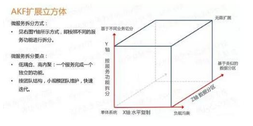

* Nginx 支持最高并发 3w
* tomcat最大连接数200

### 一、开篇
   在所有的系统中 都会有系统的开始和中期,除非是一开始就将所有的都考虑好,不然的话都会经历一个从单体结构到集群到分布式的这样
   一个步骤的,这里抄了一篇讲的很好的 原文 https://segmentfault.com/a/1190000018626163  
   每一个技术的出现都是为了去解决瓶颈或者说是痛点的,要将这个技术应用到对应的场景上去,如果你现在没有了解到这个技术的场景,盲目用这个技术是不对的  
   
   #### 1.1、微服务架构方案
   当进行微服务拆分的时候原则是根据是: 通过加机器就可以解决容量和可用性问题。  
   在云概念普及的今天,这个理念非常适用  
     
   * X轴 水平扩展： 通过绝对平等的复制服务与数据,解决容量和可用性的问题,也就是**将微服务运行多个实例,做集群加负载均衡的模式**
   * Y轴 功能扩展: 将庞大的整体应用拆分成多个服务,每个服务实现一组的功能
   * Z轴 数据分片: 这个基本上说的是数据库进行分表拆分之类的

### 二、三种区域的架构
#### 2.1、nginx架构
   这个是请求过来的第一层,当请求数大于默认的3w 就会存在请求太多了处理不过来的情况 这个时候架构就需要升级了  
      
    由于瓶颈在Nginx，因此无法通过两层的Nginx来实现多个Nginx的负载均衡。图中的LVS和F5是工作在网络第四层的负载均衡解决方案，
    其中LVS是软件，运行在操作系统内核态，可对TCP请求或更高层级的网络协议进行转发，因此支持的协议更丰富，并且性能也远高于Nginx，
    可假设单机的LVS可支持几十万个并发的请求转发；F5是一种负载均衡硬件，与LVS提供的能力类似，性能比LVS更高，但价格昂贵。
    由于LVS是单机版的软件，若LVS所在服务器宕机则会导致整个后端系统都无法访问，因此需要有备用节点。可使用keepalived软件模拟出虚拟IP，
    然后把虚拟IP绑定到多台LVS服务器上，浏览器访问虚拟IP时，会被路由器重定向到真实的LVS服务器，当主LVS服务器宕机时，
    keepalived软件会自动更新路由器中的路由表，把虚拟IP重定向到另外一台正常的LVS服务器，从而达到LVS服务器高可用的效果。  
    
     
   **当并发达到几十万的时候,单机LVS也无法支持,由于用户在各地就可以用DNS轮询实现机房的负载均衡**
   
#### 2.2、服务架构
   当请求经过了nginx到达了业务层,这个时候就要考虑,tomcat 能承受的并发会不会被打穿,所以我们最开始的单体结构是不能支持大批量的请求的,首先我们需要知道的是单体架构对后面的提升会有那几方面的问题.
   * 代码可维护性: 所有的应用都放在一个单体上,代码都写在一起,不好扩展
   * 更高的可用性: 将风险平摊到了每一个服务上,如果一个服务挂掉了 不会影响整体的系统,只是一个服务不可用
   * 监控方便: 方便的对每个应用进行监控,可以很容易的定位问题在哪里
   

   