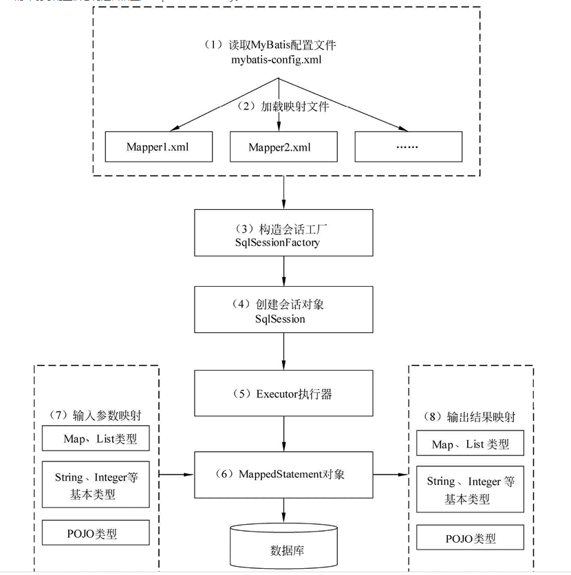

### 1. 啥是mybatis？
   mybatis 是一个spring 链接数据库的一个持久层框架,是一个半自动化的框架 不会像hibernate 那样直接全表映射上去 支持动态sql,对象映射等功能

### 2.那它的工作原理是啥

   #### 2.1 mybatis的核心组件
   大概的就是 SqlSessionFactoryBuilder -> sqlSessionFactory -> SQLSession -> mapperProxy
   * mapperProxy：每一个mapper 对象其实是一个接口，没有具体的实现 这个就是通过动态代理 将每一个mapper 动态生成对应的类,
   * SQLSession： 可以通过这个获取mapperProxy,每一个方法想要去执行sql 都要创建这一个类 用他来执行sql(其实最终是通过Executor来执行的) 生成这个看DefaultSqlSessionFactory#openSessionFromDataSource
   * sqlSessionFactory：这个是生成 sqlSession 的工厂, 通过 Confuguration 获取相关的配置, 这个文件是 SqlSessionFactoryBuilder 生成的
   * SqlSessionFactoryBuilder：解析配置文件 生成一个sqlSessionFactory

   #### 2.2 mybatis 的工作流程
   
     如果只是引入了mybatis 加载 xml 文件 然后配置 扫描路径 会动态根据路径中的mapper 动态生成代理  
   如果是引入了spring boot 那就是通过注解将要扫描的mapper 放在里面 之后就是生成动态代理 运行的时候就是通过 是sqlSession中executor来执行

   #### 2.3 加载步骤
   https://blog.csdn.net/newbie0107/article/details/102763685
   1. 读取XML配置文件和注解中的配置信息，创建配置对象，并完成各个模块的初始化的工作  SqlSessionFactoryBuilder.build  生成一个  sqlSessionFactory   
        其实这个时候我们所有的mapper 文件已经全部解析完毕了 放在 Confuguration 的 mapperRegistry 中
   2. 我们在使用的时候 是用 sqlSessionFactory.openSession(true) 获取一个 SqlSession， 然后SqlSession.getmapper() 这里面会从 Confuguration的mapperRegistry
       中通过动态代理的形式生成一个出来
   3. 

#### Q:mybatis 的延迟加载?
   什么是延迟加载,是不需要的数据不一次查出来 先查出来一部分 然后在需要的时候自动去查询 
   延迟加载一般又叫按需加载，在需要的时候在加载，一般是用在关联查询中的 在mybatis 中的resultMap中的 associate(一对一) 和collection(一对多) 这两个映射关系  
   一般是< association property="主model中要映射的" column="查询列名" select="副mapper中的方法 com...selectById">< /association>    
   它的原理是：使用CGLIB创建目标对象的代理对象，当调用目标方法时，进入拦截器方法，比如调用a.getB().getName()，拦截器invoke()方法发现a.getB()是null值，那么就会单独发送事先保存好的查询关联B对象的sql，把B查询上来，然后调用a.setB(b)，于是a的对象b属性就有值了，接着完成a.getB().getName()方法的调用。这就是延迟加载的基本原理。

#### Q:mybatis的缓存？
   缓存就是--第一次过来查询 先去缓存里面 如果缓存里面有的话 就用缓存里面的  如果缓存里面没有的话就去数据库查询 查询出来之后 放进缓存中.
      将查询出来的数据放进缓存里面
   * 一级缓存：   
        是sqlSession 级别的缓存,每个session是独立的,，commit(增删改)操作会删除缓存,但是当整合了spring之后 spring将事务放进service里面管理，而每个service的sqlsession是不同的,每次查询之后都是要关闭sqlsession的 关闭之后
   缓存是被清空的,所以 如果整合了spring 不开启事务的话,一级缓存是没有意义的。
   * 二级缓存：  
        是mapper级别的缓存,也是namespace级别的缓存 默认是不开启的,多个sqlsession可以共用一个二级缓存,但是可能造成脏读, 比如 orderMapper和 orderdetailMapper,查询详情的时候查询订单的数据了 
        放入缓存，这个时候orderMapper修改了 但是 orderdetailMapper 里面的缓存是不修改的。

   
   
   
   
   
   
   
   
   
   
   
   
   
   
   
   
   
   
   
   
   
   
   
   
   
   
   
   
   
   
   
   
   
   
   
   
   