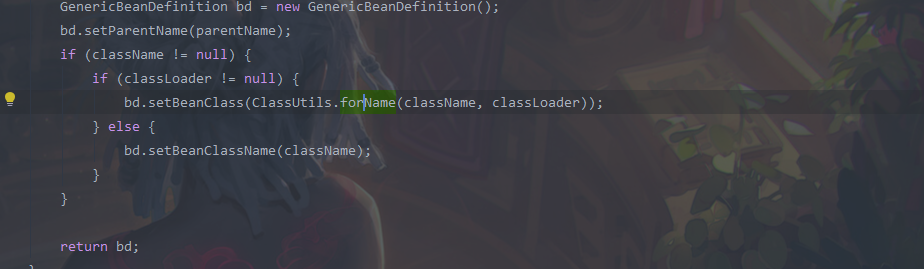

### 前言: 为什么要用spring  他给我们带来了什么好处？
   在java 的基础开发中 我们自己new 出来对象 然后管理他的生命周期  
   
   ioc : 而spring 提供的ioc 容器让我们不用管对象的创建和对象的生命周期 这些都交给spring来管理 spring 有自己定义的类加载器来加载类  
   Di(依赖注入)： 当两个类相互依赖  由于都是交给spring 管理 这个时候直接引用就行了   比如要实例化一个service 里面用@Aotowari 注解或者 @Resouece 引入了别的实例 这种属性注入

### 源码分析:
  首先需要明白类的加载关系,
  
  spring是通过反射用类加载器加载xml中配置的bean的
  


### 二、spring生命周期
   
  首先会设置beanFactory 将所有的bean 放在这个里面, 容器说到底就是一个map  name -> bean  然后设置类加载器 看bean是否实现了一些类 然后执行这些方法 然后将类进行初始化 
   
  #### 2.1首先看懂spring的生命周期有什么用? 
  从上面的生命周期我们可以很清楚的看清,我们所注入到的bean是在什么时候加载的,如果我们要对加载的bean在他加载之前进行操作 应该怎么做？
  
Q: 首先的疑问是 bean 实现了 一些接口 在调用这些接口的时候 这些bean的属性有没有被加在的  属性是在什么时候加载的?

总结: 使用spring 的时候 用到的就是啥都不用管 都交给spring 来管理(spring 的初始化 bean 容器的管理) 


### 三、IOC
   #### 3.1 重要的类
   * Resource: 都是解决配置文件从哪里读取 以及如何读取。
   * BeanDefinition: 这个接口以及其他实现的接口, 可以理解为一个bean的定义 bean名字类型和一些引用,在ioc中如何定义这个bean以及产生实例,ioc容器初始化的时候就是把这个放进了map中
   * beanFactory: 在已经获取bean定义的情况下,如何装配和获取bean实例
   * ApplicationContext: 是继承beanFactory 的 但是它担任的是一个工厂的职责 对上面的进行聚合处理
   
   #### 3.2 流程
   1. 首先就是spring的启动看是什么方式启动的 一般是AbstractApplicationContext中的refresh 方法,然后就是加载所有要放进ioc 的类 将他们放进DefaultListableBeanFactory 的beanDefinitionMap中,
   2. 这个时候已经加载和注册完毕了 看那个接口实现了BeanFactoryPostProcessor 执行方法
   3. registerBeanPostProcessors()看那个map中有哪些类继承了 BeanPostProcess 将他们放入 beanPostProcessors 列表中
   4. 创建bean的实例 然后看有没有前置方法执行 然后 initializeBeanBean() 这里应该是aop注入的时机  然后执行后置方法
   


### 四、AOP 面向切面编程: 使用动态代理对方法进行增强

   #### 4.1 AOP 和 AspactJ 有什么区别
   可以说是AspactJ是AOP 的完全版本,   
   AOP 是基于Spring 的IOC的, 纯spring 代码 和AspactJ没什么关系    当对一系列(有特征的)方法进行统一处理,spring 的aop 是基于动态代理的 如果是对有接口的 是使用JDK Proxy进行代理的
   如果是没有实现接口的 那么就无法使用JDK Proxy进行代理了 这个时候就使用 cglib生成一个被代理的子类进行代理
   
   
   #### 4.2 aop术语
   Pointcut： 切点  解析式里面可以用 类似于正则表达式的匹配到很多  这些点形成一个切面
   
   


   


### spring的执行源码分析

```java
public class A{
    @Override
    public void refresh() throws BeansException, IllegalStateException {
       // 来个锁，不然 refresh() 还没结束，你又来个启动或销毁容器的操作，那不就乱套了嘛
       synchronized (this.startupShutdownMonitor) {
    
          // 准备工作，记录下容器的启动时间、标记“已启动”状态、处理配置文件中的占位符
          prepareRefresh();
    
          // 这步比较关键，这步完成后，配置文件就会解析成一个个 Bean 定义，注册到 BeanFactory 中，
          // 当然，这里说的 Bean 还没有初始化，只是配置信息都提取出来了，
          // 注册也只是将这些信息都保存到了注册中心(说到底核心是一个 beanName-> beanDefinition 的 map)
          ConfigurableListableBeanFactory beanFactory = obtainFreshBeanFactory();
    
          // 设置 BeanFactory 的类加载器，添加几个 BeanPostProcessor，手动注册几个特殊的 bean
          prepareBeanFactory(beanFactory);
    
          try {
             // 【这里需要知道 BeanFactoryPostProcessor 这个知识点，Bean 如果实现了此接口，
             // 那么在容器初始化以后，Spring 会负责调用里面的 postProcessBeanFactory 方法。】
    
             // 这里是提供给子类的扩展点，到这里的时候，所有的 Bean 都加载、注册完成了，但是都还没有初始化
             // 具体的子类可以在这步的时候添加一些特殊的 BeanFactoryPostProcessor 的实现类或做点什么事
             postProcessBeanFactory(beanFactory);
             // 调用 BeanFactoryPostProcessor 各个实现类的 postProcessBeanFactory(factory) 回调方法
             invokeBeanFactoryPostProcessors(beanFactory);         
    
    
    
             // 注册 BeanPostProcessor 的实现类，注意看和 BeanFactoryPostProcessor 的区别
             // 此接口两个方法: postProcessBeforeInitialization 和 postProcessAfterInitialization
             // 两个方法分别在 Bean 初始化之前和初始化之后得到执行。这里仅仅是注册，之后会看到回调这两方法的时机
             registerBeanPostProcessors(beanFactory);
    
             // 初始化当前 ApplicationContext 的 MessageSource，国际化这里就不展开说了，不然没完没了了
             initMessageSource();
    
             // 初始化当前 ApplicationContext 的事件广播器，这里也不展开了
             initApplicationEventMulticaster();
    
             // 从方法名就可以知道，典型的模板方法(钩子方法)，不展开说
             // 具体的子类可以在这里初始化一些特殊的 Bean（在初始化 singleton beans 之前）
             onRefresh();
    
             // 注册事件监听器，监听器需要实现 ApplicationListener 接口。这也不是我们的重点，过
             registerListeners();
    
             // 重点，重点，重点
             // 初始化所有的 singleton beans
             //（lazy-init 的除外）
             finishBeanFactoryInitialization(beanFactory);
    
             // 最后，广播事件，ApplicationContext 初始化完成，不展开
             finishRefresh();
          }
    
          catch (BeansException ex) {
             if (logger.isWarnEnabled()) {
                logger.warn("Exception encountered during context initialization - " +
                      "cancelling refresh attempt: " + ex);
             }
    
             // Destroy already created singletons to avoid dangling resources.
             // 销毁已经初始化的 singleton 的 Beans，以免有些 bean 会一直占用资源
             destroyBeans();
    
             // Reset 'active' flag.
             cancelRefresh(ex);
    
             // 把异常往外抛
             throw ex;
          }
    
          finally {
             // Reset common introspection caches in Spring's core, since we
             // might not ever need metadata for singleton beans anymore...
             resetCommonCaches();
          }
       }
    }
}
```

#### Q: beanFactory 和 factoryBean 的区别？
   首先明白beanFactory 是一个接口 在上面的源码中 他是ioc容器的一个工厂 getBean() 的方法都注册到这个上面的  
   factoryBean 也是一个接口,主要是让我们可以自定义bean 的创建过程(你可以new一个其他的类然后返回),只要实现这个借口，可以自定义bean的创建过程，一般用于bean的创建比较复杂的场景，比如数据库连接池的创建

#### Q: BeanFactoryPostProcessor 和 BeanPostProcessor 的区别？
   BeanFactoryPostProcessor 是先于 BeanPostProcessor 的,BeanFactoryPostProcessor 是在所有bean 加载注册之后进行的 这个时候就可以对这些bean进行修改  
   BeanPostProcessor 是spring 的后置处理器 两个方法 是在实例化之前和实例化之后执行的,可以配置多个 是一个执行链 一个的返回值作为另一个的入参  

#### Q: Aware 类
   aware 方法是在类没有实例化的时候 去看那些类有实现这些的


### 关于问题的总结
 #### Q: spring 中 A(没有事务)调用 B(有事务) 同类中 B 的事务生效吗 如果不生效 为什么？
   不生效 事务的本质是代理 是调用的时候对这个类的方法 进行 aop 增强 如果是同类调用 没法 用代理  所以事务不生效
   原理大概就是 调用这个方法前 开启mysql 事务 start TRANSACTION 之后 commit 或者 roback   
   
 #### Q: 事务的传播特性？
   spring 编程中肯定是用到事务, 假如方法A(有事务),调用方法B(有事务), 这个时候 try 住 B B 事务回滚 A 也会回滚 ,因为默认的传播特性是第一个 , 总共是有以下传播特性的
   * **PROPAGATION_REQUIRED：默认事务类型，如果没有，就新建一个事务；如果有，就加入当前事务。适合绝大多数情况。**
   * PROPAGATION_REQUIRES_NEW：如果没有，就新建一个事务；如果有，就将当前事务挂起。
   * PROPAGATION_NESTED：如果没有，就新建一个事务；如果有，就在当前事务中嵌套其他事务。
   * PROPAGATION_SUPPORTS：如果没有，就以非事务方式执行；如果有，就使用当前事务。
   * PROPAGATION_NOT_SUPPORTED：如果没有，就以非事务方式执行；如果有，就将当前事务挂起。即无论如何不支持事务。
   * PROPAGATION_NEVER：如果没有，就以非事务方式执行；如果有，就抛出异常。
   * PROPAGATION_MANDATORY：如果没有，就抛出异常；如果有，就使用当前事务。
   
   我们可以通过在 @Transactional(rollbackFor=Exception.class,propagation= Propagation.NESTED) 里面指定传播特性来指定


 #### Q: Autowired注解 和 Resource 注解的区别？
 Autowired注解 默认是根据 类型来查找bean, Resource 注解 默认是根据名字来查找bean  
 对于只有一个实现的来说这两个没啥区别,对于有多个实现的 如果是指定了某一个实现的名称 那Autowired注解 还是会查找所有的， Resource 只会返回这个名字的一个bean


