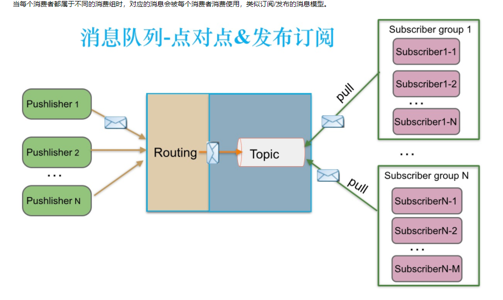
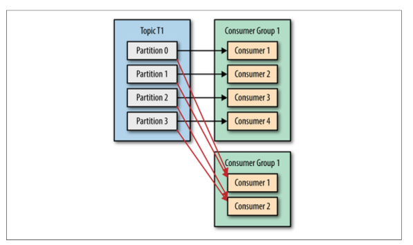
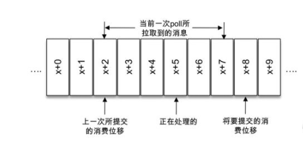

> 无论你正经历着什么，过得是否开心，世界不会因为你的疲惫，而停下它的脚步。那些你不能释怀的人与事，总有一天会在你念念不忘之时早已遗忘。无论黑夜多么漫长不堪，黎明始终会如期而至。
* kafka的消息模型是什么
* kafka的消息是怎么消费的

### 一、kafka的消息模型
     
   * 生产者: 负责发送消息的
   * topic: 主题,生产者和消费者都是对这个主题进行的操作
   * 分区(partition): 存在于topic中的,一个topic可以有多个partition, 可以理解于消息队列中的队列
   * 消费者组: 每个消费者组都是相对独立的 都能获取到全量的订阅的消息
   * 消费者: 在消费者组中的,订阅主题的分区对应的就是消费者 如果消费者数据大于分区 会多余
   
   #### 1.1 多副本机制
   kafka为分区引入了多副本（Replica）机制,分区中的多个副本会有一个leader和其他的follower,我们发送的消息被发送到leader副本，然后follower副本才能从leader副本拉消息  
   生产者和消费者只于leader交互,其他的follower只是为了保证消息存储的安全性,当leader挂了 其他的选举出一个leader出来
   
### 二、 消费者是怎么消费的
     
   每个不同的业务分为一个消费者组,订阅一个topic的全量消息,如果消息堆积过多,我们一般在消费者组中增加消费者 这样多消费者就可以将消息尽快的消费  
   消费者在消费消息的时候 在本地保存一个offset 可以手动或者自动更新到服务器,标明消费的消息到哪里了 是一个偏移
   

### 三、集群的部署
   对于kafka集群的部署就需要引入一个中间键来进行机器的管理，这里引入的是zookeeper 来进行机器的管理。
   
   #### Kakfa Broker Leader的选举：
   Kakfa Broker集群受Zookeeper管理。所有的Kafka Broker节点一起去Zookeeper上注册一个临时节点，
   因为只有一个Kafka Broker会注册成功，其他的都会失败，所以这个成功在Zookeeper上注册临时节点的这个Kafka Broker
   会成为Kafka Broker Controller，其他的Kafka broker叫Kafka Broker follower。（这个过程叫Controller在ZooKeeper注册Watch）。
   这个Controller会监听其他的Kafka Broker的所有信息，如果这个kafka broker controller宕机了，在zookeeper上面的那个临时节点就会消失，
   此时所有的kafka broker又会一起去Zookeeper上注册一个临时节点，因为只有一个Kafka Broker会注册成功，其他的都会失败，所以这个成功在Zookeeper
   上注册临时节点的这个Kafka Broker会成为Kafka Broker Controller，其他的Kafka broker叫Kafka Broker follower。例如：一旦有一个broker宕机了，
   这个kafka broker controller会读取该宕机broker上所有的partition在zookeeper上的状态，并选取ISR列表中的一个replica作为partition leader
   （如果ISR列表中的replica全挂，选一个幸存的replica作为leader; 如果该partition的所有的replica都宕机了，则将新的leader设置为-1，等待恢复，
   等待ISR中的任一个Replica“活”过来，并且选它作为Leader；或选择第一个“活”过来的Replica（不一定是ISR中的）作为Leader），这个broker宕机的事情，
   kafka controller也会通知zookeeper，zookeeper就会通知其他的kafka broker。
   

### 三、重平衡
   重平衡其实是一个协议,它规定了如何让消费者组中的消费者来消费topic中的每一个分区,可以让消费者数据和分区尽量平均 这就是重平衡,但是重平衡期间,**消费者无法从kafka中消费消息**
   #### 重平衡的触发条件
   * 消费者组内成员发生变更
   * 主题的分区数发送变更
   * 订阅的主题发生变化:当消费者组使用正则表达式订阅主题，而恰好又新建了对应的主题，就会触发重平衡
   #### 重平衡策略
   todo
   
### 四、消息持久化
   
   
   
### 问题
   #### 如果多个消费者同时订阅一个topic， 那么消息是被这些同时消费才算消息被消费吗？
   看消费者是不是在一个消费者组里面，多个消费者组订阅的是一个topic 消息是还在topic中的，只是每个消费者组的offset 不同。
   
   
   #### topic 模式是不是一个消息可以被很多消费者消费？ 
   在 Topic 的消费过程中，由于消息需要被不同的组进行多次消费，所以消费完的消息并不会立即被删除，
   这就需要 RocketMQ 为每个消费组在每个队列上维护一个消费位置（Consumer Offset），这个位置之前的消息都被消费过，
   之后的消息都没有被消费过，每成功消费一条消息，消费位置就加一。  
   kafka分区的概念 也是这样的
   
   #### 重复消费是怎么产生的？
   
   我们知道消费者会维护一个offset 这个是可以设置定期提交的还是主动提交的，但是不可避免的是当你提交一次之后，然后消费一些消息这个offset还没提交的时候
   崩溃了，那么在次重启会从上一个offset 开始消费，这样就会出现重复消费的问题，