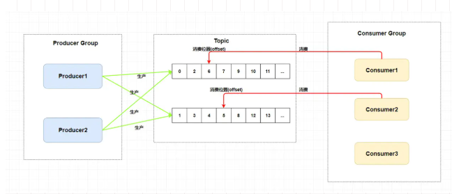
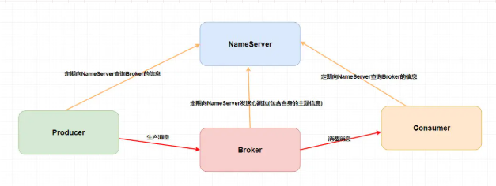

* Rocketmq 由哪些角色组成，每个角色作用和特点是什么？
* RocketMQ中的Topic和JMS的queue有什么区别？
* 消息的顺序消费 重复消费和消息堆积/丢失的问题?

## 1. RocketMq的消息模型

  rocketmq 是**主题模型**的实现,他和其他不同的mq 实现的不同,下面是rocketmq的**消息模型**。
   
   在整个中可以看到有三种角色**Producer Group**，**Topic**,**Consumer Group**三种角色

   * Producer Group 生产者组： 代表某一类的生产者，比如我们有多个秒杀系统作为生产者，这多个合在一起就是一个 Producer Group 生产者组，它们一般生产相同的消息。

   * Consumer Group 消费者组： 代表某一类的消费者，比如我们有多个短信系统作为消费者，这多个合在一起就是一个 Consumer Group 消费者组，它们一般消费相同的消息。

   * Topic 主题： 代表一类消息，比如订单消息，物流消息等等。

     重要： 一个topic可以配置多个队列 一个队列只能有一个消费者,当这个消费者挂掉后 消费组的其他消费者接替消费

## 2. Rocketmq的架构模型
   
   从上面可以看出 分为四个角色
   * NameServer 这个是个注册中心 起着管理其他角色的责任, 生产者和消费者从注册中心获取Broker 的信息
   * Broker  这个是主要负责消息的存储、投递和查询以及服务高可用保证。说白了就是消息队列服务器嘛，生产者生产消息到 `Broker` ，消费者从 `Broker` 拉取消息并消费。
   * Producer 生产者 生产消息的
   * Consumer 消费者 消费消息的

## 3. 消息的存储

## 4.集群的高可用
   

## 队列问题的解决
### Q:为什么用这个mq ？
   和rabackmq 相比 他是分布式的 并且可用性比较高的 和kafka都是比较推荐的，kafka还有就是消息的重复消费 放在大数据中是比较推荐的.
    rocketmq是java 的 可以通过副本来记录防止丢失.

### Q: 消息顺序不一致的问题
​	同一队列的话可以保持顺序消费一直 但是在同一topic多个消息队列是不能保持一直的,如果我来解决的话 可以设置为**严格顺序**的 但是这样可能一个机器不可能 就整个不可用了 所有我一般将东西放进队列的话是可以容忍一点的不一致的.
    像这种强一直的消息 我是使用redis 的队列来实现的 左放入 右取出.

### Q:  消息重复消费的问题
​	基本上的接口都要做到幂等 尤其这种mq的消息消费的问题

### Q:  消息堆积的问题
​     首先确定消费者在正常消费 是不是出现消费者消费错误 或者线程卡死  如果正常的话就增加 增加消费者来加快消费

参考：https://juejin.im/post/6844904018322391054