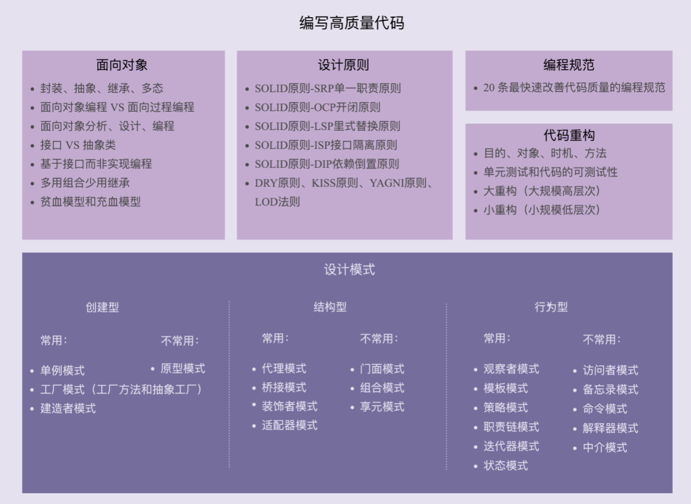

https://www.runoob.com/design-pattern/design-pattern-intro.html

### 1.什么是设计模式？
   我的理解，它就是一种问题的通用解决方案 无论是什么语言 它只是一个思路，可以解决问题的思路。  
   我们用设计模式是要遵循一些原则的 但是对于目前的我来说 它反倒是阻碍了我学习设计模式的绊脚石，人类总是在不断的试错中成长 设计模式的原则放在最后  
   

### 2.我们应该怎么使用设计模式 有没有什么好的方式可以区分？
   
   
### 3.有哪些设计模式?

创建型模式

####  工厂模式
   首先明确是创建型的,就是创建对象的时候(明确地计划不同条件下创建不同实例时)用到这个模式,  
   
   
   
   
   

结构型模式

####  代理模式
   不适合直接访问,相当于对访问对象加上一层对此对象的访问层,在访问这个类的时候做一些控制(是不是可以理解controller就是对service的一种代理？)

####  模板方法模式
   主要就是基类对这个方法定义,不同的子类有不同的实现,一般就是使用抽象类来实现.

### 自己的原则
   基本上能写面向对象就面向对象 每个类的职责尽量单一,是他自己的行为的放在这个类,  
   多用组合少用继承 继承层次过深、继承关系过于复杂会影响到代码的可读性和可维护性,用组合

### 设计模式的使用原则
   1、开闭原则（Open Close Principle）  
   开闭原则的意思是：对扩展开放，对修改关闭。在程序需要进行拓展的时候，不能去修改原有的代码，实现一个热插拔的效果。简言之，是为了使程序的扩展性好，易于维护和升级。想要达到这样的效果，我们需要使用接口和抽象类，后面的具体设计中我们会提到这点。
   
   2、里氏代换原则（Liskov Substitution Principle）  
   里氏代换原则是面向对象设计的基本原则之一。 里氏代换原则中说，任何基类可以出现的地方，子类一定可以出现。LSP 是继承复用的基石，只有当派生类可以替换掉基类，且软件单位的功能不受到影响时，基类才能真正被复用，而派生类也能够在基类的基础上增加新的行为。里氏代换原则是对开闭原则的补充。实现开闭原则的关键步骤就是抽象化，而基类与子类的继承关系就是抽象化的具体实现，所以里氏代换原则是对实现抽象化的具体步骤的规范。
   
   3、依赖倒转原则（Dependence Inversion Principle）   DIP
   这个原则是开闭原则的基础，具体内容：针对接口编程，**依赖于抽象而不依赖于具体**。  
   就是在使用方法的时候尽量引用抽象的接口的方法,不直接写具体的实现,而对于对象的创建之类的 可以用抽象工厂,让代码不写入具体的实现
   
   4、接口隔离原则（Interface Segregation Principle）  
   这个原则的意思是：使用多个隔离的接口，比使用单个接口要好。它还有另外一个意思是：降低类之间的耦合度。由此可见，其实设计模式就是从大型软件架构出发、便于升级和维护的软件设计思想，它强调降低依赖，降低耦合。
   
   5、迪米特法则，又称最少知道原则（Demeter Principle）  
   最少知道原则是指：一个实体应当尽量少地与其他实体之间发生相互作用，使得系统功能模块相对独立。
   
   6、合成复用原则（Composite Reuse Principle）  
   合成复用原则是指：尽量使用合成/聚合的方式，而不是使用继承。