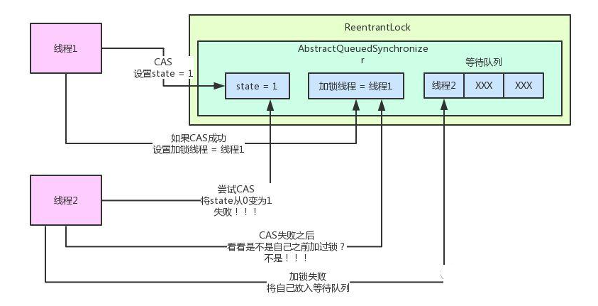

### 1. 为啥会有锁 ？
   单线程的情况下 是不会有锁的情况的,也就是 都是自己执行的 不用考虑多个线程 并发 加锁的情况
   所以 多线程情况下需要考虑锁的问题,也就是当多个线程可能同时访问一个资源的时候,就要考虑这个资源在一个时刻在每个线程中是不是一样的    
   也就是解决了多线程中的**可见性**问题.
   
### 2. 线程安全
   当出现并发的时候就要考虑线程安全的问题了,线程安全的定义也是不同的 对于颗粒度的定义,比如线程安全可以分为以下几种
   * 不可变: 也就是属性永远不会改变 其他的线程也就看不到值不一样的了
   * 绝对线程安全: 所有的属性和方法都加上synchronized修饰
   * 相对线程安全: 对于一些特定顺序的连续调用,可以加上synchronized
   * 线程兼容: 对象本身不是线程安全的,但是调用者正确使用同步手段来保证线程安全
   * 线程对立: 值得是无论调用者怎么使用同步手段 都无法保证线程安全 这个是不被使用的一种
   
   一般我们都是相对线程安全,对可能会发生线程不安全的代码进行解决,解决方案一般是以下几种。
   * 互斥同步: 最常见的一种方式,就是并发访问共享数据时,对共享数据**加锁**,让这个数据同一时间只能被一个线程访问,互斥是手段 同步是目的,悲观锁
   * 非互斥同步: 互斥同步的时候其实是悲观锁,我们可以通过cas(Compare-and-swap)比较并替换的形式加一个乐观锁
   * 无同步方案: 当没有涉及到共享数据的时候其实并发就不会存在不安全 这个时候是不用进行线程安全考虑的.


### 3.锁的实现？

   #### 3.1 volatile  轻量级锁
   这个具体项目中没有用到过,但是这个号称是一个轻量级的锁，  
   
   号称只要在变量前面加了这个值 每个线程在修改完之后 都会强行刷会主存,解决了多线程之间可见性的问题  
   
   可以防止指令重排和有序性

   #### 3.2  synchronized   其使用监视器 (monitor) 来实现  - 悲观锁
   加在方法的前面 表示调用到这个方法的时候 同一时间只有一个实例可以调用 其他的调用的时候会等待
   
   是一个自动挡  会自动 --> 偏向锁   --> 轻量级锁（自旋锁）  ——>重量级锁    这都是自己实现的
   
   #### 3.3 CAS 实现锁 - 乐观锁
   在大名鼎鼎的JUC包下的**Atomic**，原子类是在对多线程使用变量时的轻量级实现,其底层实现原理就是 CAS(compare and set) 即 比较并设置  
   
   首先将值取出来，然后将值改变，在设置进去的时候 判断这个值是不是取出来的这个值，如果不是，则获取这个值,重新执行这个逻辑
   
   缺点： 如果多线程对这个字段进行修改的时候，会导致很多线程一直进入自旋的过程
   
   在java8 对 如果是操作AtomicInteger 的时候一个新的类 LongAdder 是通过 **自动分段迁移** 和CAS 来实现的  
   如果请求的数据超过一定的数量,就会在内部生成一个 cell数组，初始值为0, 将请求过来的线程hash到对应的数组上 对这个数据进行cas操作  
   当获取值的时候，将所有的cell数组的值加起来返回
    
   
   #### 3.4 Lock 
   JDK 1.5 之后才引用的 一个接口  位于JUC 包下  
   
   使用: 有几个重要的实现  ReentrantLock(可重入锁)  ReadWriteLock(读锁)  
   
   ##### 3.4.1 ReentrantLock 可重入锁
   如果想要了解可重入锁的实现 那么肯定避不开什么是AQS(AbstractQueuedSynchronize) 抽象队列同步器  
   aqs 内部非常重要的属性
   * state: int 类型 是代表了加锁的状态,初始值为0
   * thread : 代表当前持有这个锁的线程
   * Node prev：是一个队列的前一个
   * Node next：是一个队列的下一个
   
   如果通过lock 加锁解锁的流程是什么呢？
   * 判断当前state 是否为0 如果是0 的话就将state cas 改为 1 并将当前线程变为自己
   
   * 如果下一个进来之后 查看当前state 为 1 了 就在后面排队
   
   * 如果第一个线程继续加锁 就是重入 这个时候将state加1
   * 如果第一个线程解锁了,那么将state 变为0 唤醒后面所有的线程
   
   ##### 3.4.2 公平锁和非公平锁
   ReentrantLock 默认是非公平锁, 在构造方法里面传入 true 可变成公平锁 
   
   对于上面的最后一步, 线程解锁唤醒之后的线程,会根据是否是公平锁的策略  
   如果是公平锁： 会判断队列中排列顺序,先入队的先出来加锁  
   如果是非公平锁： 唤醒所有的线程,通过cas争抢这个锁,谁抢到就是谁的
   
  
   #### 3.4.3 读写锁
   在使用锁的时候,会涉及到加锁之后的操作是要干什么,是不是必须要加一个别人不能访问的锁, 重入锁在这里有一个实现  ReentrantReadWriteLock(读写锁),用法如下
   ```text
        ReentrantReadWriteLock lock = new ReentrantReadWriteLock();
        
        //读锁
        lock.readLock().lock();
        lock.readLock().unlock();
        
        //写锁
        lock.writeLock().lock();
        lock.writeLock().unlock();
```
    
    当使用读写锁的时候,涉及到读读写锁访问的问题
    * 当你用的读锁,别人是可以用读锁的,但是不能用写锁
    * 当你用的写锁,别人是不能用读写锁的,是被锁定的
   
          
        
```
公平锁 继承 Sync
    数据结构:  是一个链表结构
        waitStatus :  -1 说明当前线程正在执行 其他线程判断到当前这个线程在 -1 时 会休眠等待这个唤醒
        prev Node  ： 前驱节点
        next Node  ： 后续节点
        thread    ： 当前线程
    尝试加锁lock()
        如果状态是0 将当前线程设置为共享的线程 状态+ 1
        如果不为0  判断是不是当前线程 如果是 再 + 1
        如果都不是
            队列不为空   加到队列最后面  pre = node    node.next = 当前
            否则  enq()  自旋锁方式入队
        判断需不需要挂起
            如果前驱等于 -1 说明前驱节点正常 直接挂起  等待前驱节点结束 唤醒你
    尝试释放锁 unlock()
         判断一下是不是我这个线程当前锁
         如果是   判断是不是可重入 不重入直接释放  重入 state -1
         唤醒后继节点
非公平锁  继承Sync
    尝试加锁  lock()
        首先 cas 获取锁一次  如果没有的话  判断 如果state == 0 的时候 直接强锁
            这个会导致 如果是公平锁和非公平锁同时进入 非公平锁会得到锁 这是不公平的

```

### 4.如何避免死锁(不要盲目加锁)
   * 互斥: 一个资源同一时间只能被一个进程使用
   * 不可剥夺条件： 在进程使用资源的时候不能对这个资源进行强行剥夺
   * 请求与保持条件： 当这个进程进行阻塞的时候 会对以持有的资源不放
   * 循环等待条件： 若干进程之间形成收尾相接的循环等待条件。
   要防止死锁的话就破坏上面四个条件就行了 第一个互斥是不能被破坏的,因为我们加锁就是让他互斥的 所以 就破坏其他三个就行了


