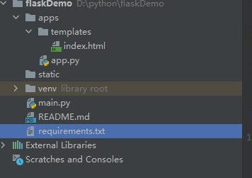

### 一、最佳实践
   #### 1.1 导入依赖
   ```
    pip install Flask
```
   #### 1.2 创建一个app.py
   目录格式如下  
     
   ```$xslt
        # 导入Flask类
        from flask import Flask,render_template,request,redirect
        import time
        
        # 实例化，可视为固定格式
        app = Flask(__name__)
        
        # route()方法用于设定路由；类似spring路由配置
        
        # 1. render_template 返回html模板方法
        @app.route('/')
        def index():
            return render_template("index.html")
        
        # 2. 直接返回字符串
        @app.route('/text')
        def index():
            return "返回字符串格式!"
        
        # 3. 重定向
        @app.route('/redict')
        def index():
            return redirect("/")
        
        if __name__ == '__main__':
            # app.run(host, port, debug, options)
            # 默认值：host="127.0.0.1", port=5000, debug=False
            app.run(port=80)
```