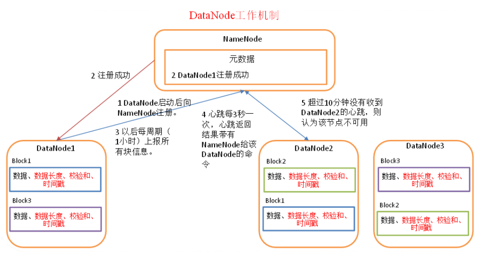

> 数据本身是无用的，除非你能从中获取到有价值的洞察。

### 一、啥是大数据，啥是hadoop？
   在科技日新月异的今天数据的存储已经不是一个硬盘能存储的，当我们对海量的数据进行存储、管理、计算的时候就用到了大数据的技术。
   其中比较有名的就是hadoop和spark，而hadoop又是什么呢，它是目前**一套主流的技术体系**，包括
   * HDFS: 分布式文件系统，用来存储数据。
   * YARN: 分布式资源调度系统，用来管理和调度节点
   * MapReduce: 分布式计算系统，用来将要计算的海量算力进行拆分到很多台机器上计算 并将结果聚合。
   
### 二、HDFS(分布式存储系统)
   我们用HDFS系统来分布式管理文件,既然是分布式肯定有很多的系统，其中的角色
   
   #### 2.1 NameNode 
   当有很多台机器的时候 就需要有一个主节点，他就是 NameNode 它上面**负责管理整个HDFS集群的元数据metadata**，比如说，文件目录树、权限的设置、副本数的设置    
   其他的副节点都是 DataNode 
   
   因为文件目录树是放在内存中，所以当每次内存修改完毕之后,都会写一条 **edits log** 文件,当这个节点重启之后可以从edits log 进行重放
   
   ##### 2.1.1 SecondaryNameNode
   
   相当于namenode 的一个副本,保存一个fsimage文件，因为主节点的edit log 都是在内存中的，所以当主节点重启的时候,直接从这里面拉这个文件直接读取到内存中就可以直接用。
   
   ##### 2.1.2 NameNode 的架构
   当只有一台namenode 如果宕机了怎么办,这个时候就需要两台来实现。 故障转移
   
   引入一个新的磁盘文件叫做 fsimage，然后呢，再引入一个 JournalNodes 集群，以及一个Standby NameNode（备节点）。
   
   每次写 edits log 的时候都会向 JournalNodes 集群写一份，然后备用节点就从集群拉一份 这样 备用节点和主节点的数据就保持一致了。
   
   然后每隔一段时间，Standby NameNode都把自己内存里的文件目录树写一份到磁盘上的fsimage，这可不是日志，这是完整的一份元数据。这个操作就是所谓的checkpoint检查点操作。
   
   如果主节点重启，那么从备用节点传过来的 fsimage 读取到内存中，就很快。
   
   ##### 2.1.3 NameNode 是怎么顶得住每秒上千次的并发访问的
   我们知道每一次访问namenode 都会做这个操作
   1. 写本地的edits log
   2. 将edits log 向远程 JournalNodes 备份一份
   
   当并发访问的时候有一个全局的xid 来区分那个edits log 的先来后到 必须上锁，然后就会导致 加锁的时候进行本地写和网络写 这是非常耗费性能的 所以要将这两个写 放到锁外面去。
   
   用到了 分段加锁机制 + 内存双缓冲机制
   
   #### 2.2 DataNode
   
   
   
   在大数据中那些存储数据的地方就是DataNode,它是可扩展的
   * DataNode上面数据块是以文件形式存储在磁盘上的, 分为两个文件 一个相当于数据头 存储数据的长度 hash和时间戳 另一个就是文件本身.
   * DataNode 启动后向NameNode 注册，并周期性的向NameNode 上报所有块的信息
   * 有心跳机制,大概每3秒向NameNode报告,并且在这个返回的时候带过来NameNode 的命令,  十分钟不报告 则视为不可用
   
  
   #### 2.x 文件上传是怎么进行优化的？
   如果只是普通的 文件输入流在内存中 拷贝到文件输出流 传输到datanode 那性能肯定是极低的。
   
   所以要加入缓冲和异步的技术, 将输入流分段写入一个段里面,将很多个段打包成一个 包放进一个内存队列中,然后用一个线程只监听这个内存队列进行网络传输。
   
     
### 三、YARN(任务调度)
   
   分布式调度,对所有的机器进行调度，主要就是当有 MapReduce Job 过来的时候 对这些任务进行机器的调度

   #### 3.1 ResourceManager
   负责集群中的所有资源的统一调配和处理，
   
   
   #### 3.1 任务调度策略
    

### 四、Hive 
   由Facebook开源用于解决海量结构化日志的数据统计。  
   是一个基于hadoop的**数据仓储工具**，可以将**结构化的数据映射为一张表**，并提供**SQL查询** 功能。  
   如果执行的话 **本质上是HQL转化成MapReduce来执行**  
   
   明确文件和数据时有一定差别的，HDFS存储的是文件，当大批量的数据时也是存储在hdfs中的 hive 只是可以用类sql语句来 MapReduce 查询  
   1）Hive处理的数据存储在HDFS  
   2）Hive分析数据底层的实现是MapReduce  
   3）执行程序运行在Yarn上  

   
### 四、HDFS的高可用
   
   #### 4.1 JournalNode
   为了解决NameNode 的高可用，解决NameNode 的单点问题, 为了解决NameNode 相互之间的通信问题,需要通过一个 JournalNode 独立进程进行通信
   
   集群状态下NameNode 是有两种状态的
   * active： 只能有一台，是正在工作的
   * standby： 备用的,可以有多台处于这个状态
   
   在高可用的情况下,就不用配置 Secondary NameNode 了 因为处于standby 状态的可以进行 checkPoint
   
   如果是使用 zk作为高可用的时候 这个时候是不能手动切换 如果有一个挂掉了 会自动切换的 
   
   
   
   
   
   
   
   
   
   
   
   
   
   
   