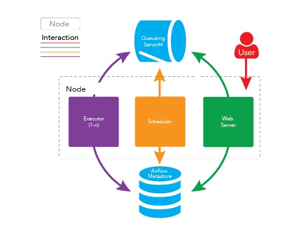

> 作为运行在服务器上面的程序，总是有启动的时机的，要么一直启动要么在某一个时间点去启动

### Airflow 调度
   这个是一个款开源的，分布式任务调度框架，通过corn 表达式 来进行调度的，通用的调度分为三个模块  
   * BashOperator: 文件调度，可以通过这个来调度一个文件的执行。
   * MySqlOperator ： sql 调度这个可以在定时执行一个sql 
   * SparkSubmitOperator ： 这个是对spark 的调度 
   
   主要是
   
   #### airflow 架构
   
   * 元数据库： 这个存储任务状态之类的信息
   
   启动了airflow 有以下几个服务被启动了
   * WebServer ： 启动了一个webserver 用来提供 UI 可视化界面操作， 要单独启动
   *  Worker : 我们需要通过work来执行具体的作业， worker 可以单独部署在多台机器上 并可以分别设置接收的队列
   * Scheduler ： 整个 调度由这个来调度启动
   
   
   
   #### centos 安装 airflow
   1. 首先安装python3 https://blog.csdn.net/llwy1428/article/details/94643098  
   
   2. airflow 数据库默认是 sqllate  所以我们需要有一个mysql的数据库 可以在本机安装也可以使用已经有的   
   数据库中是要创建 airflow 的数据库的 并且要 有对应的存task 的表  
   create database airflow default charset utf8 collate utf8_general_ci; 
   
   3. 安装airflow   
   * 使用 pip 安装  
    pip3 install apache-airflow  
    这里安装默认是放在 /root/airflow 下面的 默认的配置也在这个下面  
   * 将airflow 放进环境变量  
    export AIRFLOW_HOME=/root/airflow  
    source /etc/profile  
    * 编辑airflow的配置文件  
    