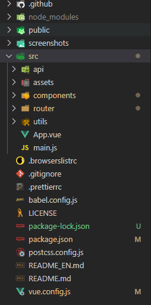

> https://blog.csdn.net/weixin_43236610/article/details/82866518

### vue 基础
   每个 Vue 应用都需要通过实例化 Vue 来实现。  
   vue 是一个只关注视图,一个自底向上的,是一个通过模板语法将数据渲染进dom的框架(双向绑定)
   
   ##### 结构
     
   * main.js: 入口文件,主要是引入vue框架，根组件及路由设置，并且定义vue实例。
   * route: 这个下面的index.js routes定义了路径为'/'的路由
   * App.vue: 一个主vue的界面 包含三个主要区域
        - template 
          其中模板只能包含一个父节点，<router-view/>为<router-view></router-view>的简写，是子路由视图，后面的路由页面都显示在此处。
        - script
          vue通常用es6来写，用export default导出，其下面可以包含数据data，生命周期(mounted等)，方法(methods)等。
        - style
          样式通过style标签<style></style>包裹，默认是影响全局的，如需定义作用域只在该组件下起作用，需在标签上加scoped，<style scoped></style>
   ##### vue 语法
   ```javascript
        Vue.use();      //vue 在使用别人的组件的时候 就通过这个引用
    // 在template 中使用 {{ msg }}  其中可以用 js 表达式 
        <p v-if="seen">现在你看到我了</p>   //可以 通过判断语句   简写形式 
        
        <!-- 完整语法 -->
        <a v-bind:href="url">...</a>
        <!-- 缩写 -->
        <a :href="url">...</a>
    
        <!-- 完整语法 -->
        <a v-on:click="doSomething">...</a>
        <!-- 缩写 -->
        <a @click="doSomething">...</a>


    var vm = new Vue({
        el: '#app',    // 控制区域
        data: { },    // 定义数据
        data() {      // 如果是一个组件的话 data 选项必须是一个函数  是通过return 和数据相关联的  
                return {
                    tagsList: [],
                    collapse: false
                };
            },   
        methods: { },    // 定义事件方法
        filters: { },    // 定义私有的过滤器
        directives: { },    // 定义私有的指令
        components: { },    // 定义实例内部私有的组件
        watch:{ },    // 监听值的变化，然后执行相对应的函数（或者步骤）
        beforeCreate() { },    // 实例刚在内存中被创建出来，还没初始化好 data 和 methods 属性之前调用此函数
        created() { },    // 实例已经在内存中创建完成，此时 data 和 methods 属性初始化完成，页面（HTML）加载完成之前（未开始编译模板）调用此函数。执行顺序：父组件 -> 子组件
        beforeMount() { },    // 此时已经完成了模板的编译，但是还没有挂载到页面中，在挂载开始之前调用此函数
        mounted() { },    // 此时已经将编译好的模板，挂载到了页面指定的容器中显示。页面（HTML）加载完成之后调用此函数。执行顺序：子组件 -> 父组件
        beforeUpdate() { },    // 状态更新之前调用此函数，此时 data 中的状态值是最新的，但是界面上显示的数据还是旧的，因为此时还没有开始重新渲染 DOM 节点
        updated() { },    // 状态更新完成之后调用此函数，此时 data 中的状态值和界面上显示的数据，都已经完成了更新，界面已经被重新渲染好了
        beforeDestroy() { },    // 实例销毁之前调用此函数。在这一步，实例仍然完全可用
        destroyed() { },    // 实例销毁后调用此函数。该钩子被调用后，对应 Vue 实例的所有指令都被解绑，所有的事件监听器被移除，所有的子实例也都被销毁

    })
    
```
   函数 方法 

   

   ##### vue 组件(重要)
   组件是可复用的vue实例,且带有一个名字,所以他们可以和new Vue 接收相同的实例(除了el这种根特有的),  
   
   
   
   #### 路由
   
   #### 运行加载过程
   当访问/ 根路径的时候显示的是 index.html页面 这个时候在index.html中应该是有一个根节点的,  
   然后这个时候进入口main.js 引入根组件App,<router-view/> 这个是子路由视图,后面的路由页面都显示在这个地方  
   这个时候在路由的配置里找对应的路由显示在这个地方  
   
//es6 以及以后支持   这是模块化
#### import from 
   ```js
    // import会加载且仅加载一次导入的模块
    import Vue from 'vue';
    //等同于 
    import Vue from "../node_modules/vue/dist/vue.js";
    // 导入 Vue  来自 后面那个路径  如果没加具体路径 默认在 node_modules中查找
    // 这个.vue 后缀省略   .js、.vue、.less 都可以直接省略
    
    //当export 不是default 的时候 要加 {} 才能获取到
    import { Vue } from 'vue';
   ```
#### export 
   模块是独立的文件，该文件内部的所有的变量外部都无法获取。如果希望获取某个变量，必须通过export输出
   ```js
    //命名式导出  导入的时候 要以 {}  导入
    export { name1, name2, nameN };
    export let name1, name2,  nameN; // also var
    export let name1 = 1, name2 = 2, nameN = 3 ; // also var, const
    
    //默认导出  导入的时候可以随意起名字 不用加{}
    const str = "export default的内容";
    export default str  
    //这个时候可以  import StringName from xx
   ```