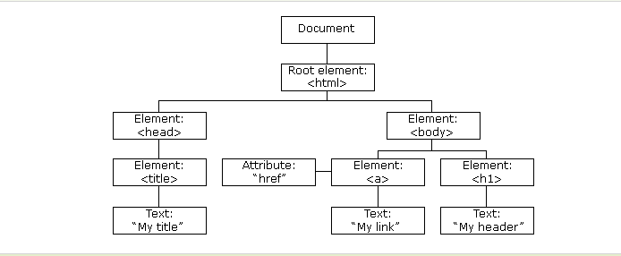
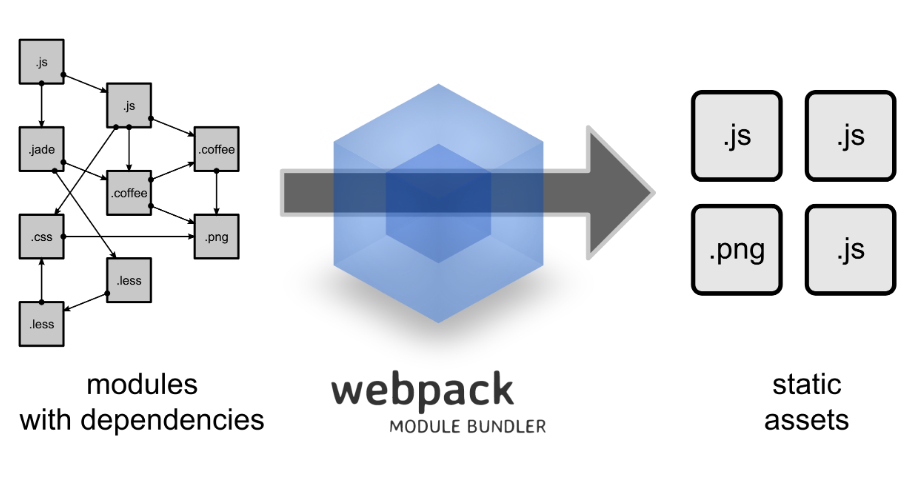

* HTML 定义了网页的内容
* CSS 描述了网页的布局
* JavaScript 网页的行为

### who is html
```html
    <!DOCTYPE html> 声明为 HTML5 文档,描述网页的语言  
     <title>                 一个标签 成对出现
     <title>元素</title>     一个元素包含一对标签
    <a href="http://www.runoob.com"> 属性  一般用在开始标签里面 在元素中添加附加信息
```
|  属性   | css中  |  描述  |
|  ----  | ----   | ----  |
| class  | :class |  为html元素定义一个或多个类名（classname）(类名从样式文件引入) |
| id     | #id | 定义元素的唯一id|
| style  | - |   规定元素的行内样式（inline style） |
| title  | - |   描述了元素的额外信息 (作为工具条使用) |


   ##### who is css
   用来渲染元素和标签的样式,一般引用css 有三种方式
   * 内部样式表： 在html中引用 <style> </style> 里面的可以直接对 body p 之类的标签进行设置
   * 内部样式: <p style="color:blue;margin-left:20px;">这是一个段落。</p>  直接在标签中使用样式属性
   * 外部引入: <link rel="stylesheet" type="text/css" href="mystyle.css"> 直接在头文件中 引入css 对页面进行统一的规划

   ##### 一些重要的元素
   * div: 区块元素,基本上用作页面的布局.
   * img:  图片标签


### who is JavaScript
  在html中的静态语言具有很大的局限性,如果页面需要动态的变化和交互那么实现起来就比较麻烦了,js的作用就是在静态页面中可以动态变化,其实说白了就是在js脚本中操作 **DOM**  和操作 **BOM**       
  使用: 一般以 <script> 脚本语句</script>，或者 <script src="/xxx.js"></script>

   ##### JavaScript基础语法
   ```javascript
var str =  "String"; // 创建一个变量
var person =  {firstName:"John", lastName:"Doe", age:50, eyeColor:"blue"}; // 创建一个对象
function functionname()         //这是一个函数
{
    // 执行代码
}   
 // 其他的语法和java 中的大差不差
   ```
   ##### JS 中的事件
   事件一般是由浏览器出发或者用户触发,常用的触发方式为 事件触发函数 

|  事件   |   描述  |
|  ----  | ----  |
| onchange	| HTML 元素改变 |
| onclick	| 用户点击 HTML 元素 |
| onmouseover	| 用户在一个HTML元素上移动鼠标  |
| onmouseout	| 用户从一个HTML元素上移开鼠标  |
| onkeydown	|  用户按下键盘按键 |
| onload	|  浏览器已完成页面的加载 |


   ##### DOM 文档对象模型(Document Object Model)
     
   通过可编程的对象模型，JavaScript 获得了足够的能力来创建动态的 **HTML**. 通过类似 var x=document.getElementsByClassName("intro"); 可以获取到对应网页中的值
   * JavaScript 能够改变页面中的所有 HTML 元素
   * JavaScript 能够改变页面中的所有 HTML 属性
   * JavaScript 能够改变页面中的所有 CSS 样式
   * JavaScript 能够对页面中的所有事件做出反应

   ##### BOM 浏览器对象模型（Browser Object Model）
   描述了与浏览器进行交互的方法和接口。由navigator、history、screen、location、window五个对象组成的，最根本对象是window。

### Who is Jquery
   jQuery 是一个 JavaScript 库.简化了js编程 只需要在头文件中 引入<script src="https://apps.bdimg.com/libs/jquery/2.1.4/jquery.min.js"> 就可以了.  
   
   ##### jq的语法
   jq的语法是通过**选取**（查询，query） HTML 元素，并对它们执行"**操作**"（actions）  
   ```js
    $(selector).action()     //基础语法  选择器里面是标签
    $("p").action()     //选中p标签 执行 
    $(document).ready(function(){     //  可简写为--->      $(function(){
       // 开始写 jQuery 代码...                                开始写 jQuery 代码...
    });                               //                    }                      
   ```
   ##### jq中的事件
   大多数 DOM 事件都有一个等效的 jQuery 方法。   
   参考 https://www.runoob.com/jquery/jquery-events.html
   
### Who is Node or Node.js
   node 就是运行在服务端的JavaScript,node环境基于V8引擎提供了一种可以让JS代码跑在后端的能力,也就是在前段开了个服务器,将整个项目打包运行  
   一个html 也可以访问,但是这只是在访问这个页面的路径，但是通过node 打包的程序可以通过端口来访问。

### who is npm
   npm 是 Node.js 官方提供的包管理工具，他已经成了 Node.js 包的标准发布平台，用于 Node.js 包的发布、传播、依赖控制，类似于java 中的maven   
   当你下载安装好node的时候，npm cli 就自动安装好了
    
### who is webpack
     
   webpack是npm生态中的一个模块，我们可以通过全局安装webpack来使用webpack对项目进行打包；  
   是一个前段的资源打包工具,将模块的依赖进行静态分析: 分析你的项目结构,将浏览器不认识的文件或者语言转化成认识的


