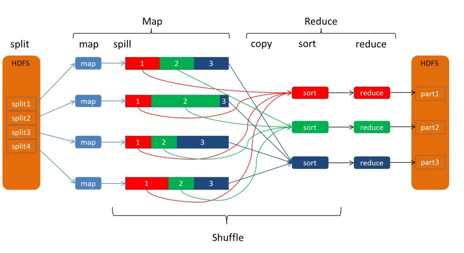

大数据前驱知识  
   * hadoop: 一个大数据计算框架,使用hdfs作为存储,多个廉价的机器组成集群
   * hive：数据仓库，Hive的本质其实就相当于将HDFS中已经存储的文件在Mysql中做了一个双射关系，以方便使用HQL去管理查丰富的SQL查询方式来分析存储在Hadoop分布式文件系统中的数据，
   可以将结构化的数据文件映射为一张数据库表，并提供完整的SQL查询功能；
   * mapreduce: 一个计算任务被拆分为多个部分,分配到集群下的计算机,多台计算机并行计算并将结果汇总. 分为mapper过程(分解) 和reduce过程(重组)
   * shuffle： shuffle 是 mapreduce 的核心， 在从map 到reduce的过程中 将输入到reduce的结果进行排序的过程叫shuffle
   

### 一、背景介绍
   spark 是和hadoop 一样的分布式数据计算框架,但是hadoop是基于HDFS 文件存储的,而 spark 是基于内存的 所以速度上来说 是要比hadoop要快的.其根本在于将**数据转成表**  
   #### 1.1 主要部件
   
   * spark core
        - RDD:弹性分布式数据集,只读的分区记录的集合，只能基于在稳定物理存储中的数据集和其他已有的RDD上执行确定性操作来创建,人话就是  
        - DAG:有向无环图,即从一个点出发历经数点之后回不到这个点(没有环), 在spark中是对RDD的关系进行建模,描述RDD的依赖关系.
   * spark sql :  以sql写计算逻辑
        
   
   这里是python 操作所需要知道的名词
   * SparkContext: 任何spark功能的入口点, 主要用于创建和操作RDD
   * SparkSession: 在1.2之前操作不同的功能需要不同的context,现在直接用SparkSession 是他们的组合 他们的功能都可以用
        - 创建和操作RDD时，使用SparkContext
        - 使用Streaming时，使用StreamingContext
        - 使用SQL时，使用sqlContext
        - 使用Hive时，使用HiveContext
   * DataFrame: 基本的表,以二维表格的形式存储数据,还有schema(数据的结构信息),性能比RDD高 并且有存储结构信息
   * DateSet： 比DateFrame更细致 能知道每个字段的类型
   * shuffle read:
   * shuffle writer:


   #### 1.2 环境安装
   * windows 操作系统
   * python 3.7
   * pySpark 库

### 二、开发语法之类
   基础数据时这个样子的列表 
   ```text
   {"database":"gateway_db","xid":1727259328,"data":{"point_id":"YC13002","update_time":"2020-12-27 22:00:30","ex":null,"create_time":"2020-12-27 22:00:30","point_value":3.78,"equipment":"C1","push_time":"2020-12-27 22:00:22","client_id":"d35e0c87-ed79-45ac-bf00-1e3abc35e9e3","quality":0},"old":{"update_time":"2020-12-27 21:59:30","create_time":"2020-12-27 21:59:30","point_value":3.93,"push_time":"2020-12-27 21:59:22"},"commit":true,"position":"mysql-bin.000614:445978746","type":"update","server_id":1228688365,"table":"real_msg","ts":1609077630}
``` 
    
   ##### 2.1 读取数据
   可以从oss上面读取  从 kafka上面读取,从本地文件读取
   ```py
     spark = SparkSession.builder\
             .appName("test") \
             .config("spark.some.config.option", "一些设置") \
             .getOrCreate() 
    # 这个是读取json 文件 将每一个读取成 dataframe
    df = spark.read.json("F://prod-zhongda+0+0024526281.json")
    
    # 读取csv 也是一样
    df = spark.read.csv("F://prod-zhongda+0+0024526281.csv")

    # 读取 parquet
    df = spark.read.parquet("F://prod-zhongda+0+0024526281.parquet")

```
   
   #### 2.2 数据过滤
   ```py
    # select 过滤字段  alias 取别名
    df = df.select(df.data.alias('data'),df.update_time.alias('update_time'))

    # filter 过滤
    # 第一种 直接在 "" 里面写表达式 
    df.filter(" xid > 33333333 ")
    # 第二种 直接写表达式 
    df.filter(df.xid > 33333)

    # where 过滤
    df.where(df.xid > 3333)    

    # udf 过滤 
    from pyspark.sql.functions import udf
    from pyspark.sql.types import *
    # 可以直接定义一个自定义函数 并注册进 sql 可以用的 后面参数是返回值类型
    test_method = udf(lambda x:(x+1),LongType())
    spark.udf.register("test_method", test_method)    
    #也可以在注册的时候 直接定义一个函数
    spark.udf.register("test_method", test_method)
```
   
   #### 2.3 api 数据计算/处理
   这个计算和处理要先确定 是df 还是rdd 
   ```python
   # 输出 df 的格式
    print(df.printSchema())

   # 将 df转成 一个list  
    dfList = df.collect()

   # Coalesce 重分区  coalesce 变少(如果传入的参数比限制分区数多 也不会变多 因为 shuffle 默认为false) repartition 变多(因为 shuffle 为true)
    df.coalesce(1)  //变少
    df.repartition()    //变多

```

   #### 2.4 用sql进行计算处理
   首先要在内存中创建表 然后对这个表进行操作,表 随着回话的关闭而删除
   ```py
    # 创建一个临时表
    df.createOrReplaceTempView("data_handler");   
    # 用sql 查询临时表中的数据
    df = spark.sql("select * from data_handler")

    # 用select 对数据进行 处理过滤
    # 可以查看每一列的值 
    df2 = df.select("xid","data")
    
    # 也可以对进行分组聚合  分组和聚合一般都是放在一起算的
    # 分组
    group = df.groupby("xid")
    # 聚合
    # 可以直接用函数 {"字段名":"函数"}   分完组了也可以根据其他的字段
    df3 = group.agg({"ts":"max"})
    # 也可以引入函数进行聚合 可以返回多个字段
    from pyspark.sql import functions as F
    df3 = group.agg(F.max("ts"),F.min("ts"))

    # 将多个表进行连接  根据表达式里面的字段进行连接
    df4 = df3.join(df,df["ts"] == df3["ts"])


```
   #### 2.5 数据写出
   ```py
       # 写入oss
       pathout = 'oss://yeshan01/test.csv'
       df.write.csv(pathout)
        
       #写入本地文件
       df.write.json("F://data.json")

```


   #### 2.6 数据展示
   ```py
    //总条数
    df.count()
    //列名
    df.columns
    //转换成pandas 数据结构
    df.toPandas()       
    //查看所有
    df.show()
    //查看第一条
    df.frist()

```

### 三、对mysql的增查
   #### 3.1 连接mysql
   首先要下载驱动  参考这个  https://blog.csdn.net/weixin_41831619/article/details/79914307  
   本地连接mysql 驱动设置的 https://www.knowledgedict.com/tutorial/spark-pyspark-unable-to-find-jdbc-driver.html  
   然后插入数据   https://blog.csdn.net/zp17834994071/article/details/108307822
  
#### RDD,DateFrame,DateSet的区别和共性
   * 相同点
     - 首先都是惰性加载的,只有遇到action和foreach时才会计算
     - 三者都有partition的概念,三者有许多共同的函数，如filter，排序等
     - 三者都会根据spark的内存情况自动缓存运算，这样即使数据量很大，也不用担心会内存溢出
   * 不同点: 感觉控制力度不一样 一个一个更细致
      
  
  
  
  
  
  
  
  
  
  
  
  
  
  
  
  
  
  
  
  
  
  
  
  
  
  
  
  
  
  
  
  
  
  
  
  
  
  
  
  
  
  