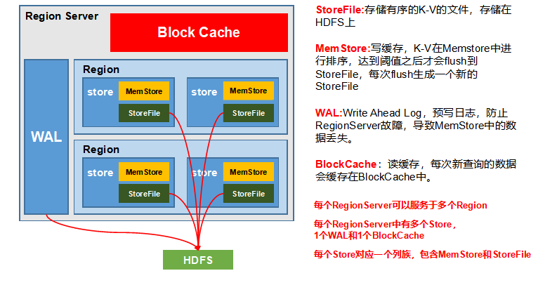

> 你越知道什么，越不知道什么。

* 行式存储和列式存储的区别
* 为什么hbase 存放大数据查询也很快

### 一、什么是Hbase 它解决了什么问题,带来了什么问题
   Hbase 是一个分布式非关系型数据库，使用列式存储(其实是列族存储)存储数据，主要是为了解决数据量过大存放以及读取的问题， 但是不支持事务，底层目前是用HDFS 
   用来提供支持
   
   #### 1.1 优点
   * 高容错， 高扩展  
   * 采用**Key/Value** 存储方式 查询效率很快
   * 列式存储 相同的列 可以存储在不同的服务器上
   
   #### 1.2 缺点
   * 部分支持ACID 
   * 不支持表关联查询
   
   #### 1.3 行式存储和列式存储的区别
   在行式存储中 是将列固定好 这样如果列为空的话 会浪费空间  比如  
   id      name    age     weight       
   1        王二      13      45  
   2        李四     12  
   
   在上面的数据放在列式存储中的话  会设置 三个列簇（Column Family，简称CF） 来存储的  
   
   |  Row-Key   | CF:Column-Key  |  Cell Value  |
   |  ----  | ----  |           ----        |
   | 1  | cf:name |    王二   |
   | 2  | cf:name |   李四    |
  
   |  Row-Key   | CF:Column-Key  |  Cell Value  |
   |  ----  | ----  |           ----        |
   | 1  | cf:age |    13   |
   | 2  | cf:age |   13    |

   通过 Row-Key 和cf 一般还会有个时间戳 这样可以确定数据， **如果列族太多，则会影响读取的性能**，所以设计的时候还是要权衡
   
   同一列中的数据属于同一类型，压缩效果显著，节省了大量的存储空间，降低了存储成本。

### 二、各个角色的作用 - 基础架构
   
   #### 2.1 Region
   Region由一个表的若干行组成，在Region中行的排序按照行键（rowkey）字典排序  
   Region由RegionServer进程管理。HBase在进行负载均衡的时候，一个Region有可能会从当前RegionServer移动到其他RegionServer上。  
   Region是基于HDFS的，它的所有数据存取操作都是调用了HDFS的客户端接口来实现的。
   
   #### 2.2 RegionServer 
   非常依赖zk服务 ，ZooKeeper管理了HBase所有RegionServer的信息，包括具体的数据段存放在哪个RegionServer上。  
   
   在每一个机器上 ， 是一个服务(进程),负责多个Region的管理， 其实现类为HRegionServer，主要作用如下:  
   对于数据的操作：get, put, delete；  
   对于Region的操作：splitRegion、compactRegion。  
   客户端从ZooKeeper获取RegionServer的地址，从而调用相应的服务，获取数据。  
   
   #### 2.3 Master
   在最先启动的那台机器上，只有一台机器上有Master，负责所有RegionServer的管理，其实现类是 Hmaster ，主要作用是：  
   对表的 增删改，这些操作可能会跨多个 region   
   当master 宕机之后，整个集群仍然可以读写，只是不能对表进行操作

### 三、Hbase shell 基本操作
   http://hbase.apache.org/book.html
   #### 部署
   在部署的时候，集群是只需要启动第一个机器  然后其他机器就启动了 启动的步骤 如果是单机的是直接使用本地的文件系统的  
   如果是集群模式的话 是根据hdfs 来连接的 所以 在配置文件里面 fs.defaultFS 一定要指定好
   

### 四、轻微进阶
   
   #### 3.1 RegionServer 架构
   
   
   
   #### 3.1 读取流程
  1. client先访问zk 获取表在哪个region service 上面
  2. 然后访问对应的 region service 看表在哪个region 上面 并将该table的region信息以及meta表的位置信息缓存在客户端的meta cache
  3. 与目标 region service 进行通信 
  4. Block Cache（读缓存），MemStore和Store File（HFile）中查询目标数据，并将查到的所有数据进行合并。
  5. 将查询到的数据块（Block，HFile数据存储单元，默认大小为64KB）缓存到Block Cache。
  6. 将合并后的最终结果返回给客户端。

   #### 3.2 写入流程
   1. client先访问zk 获取表在哪个region service 上面
   2. 然后访问对应的 region service 看表在哪个region 上面 并将该table的region信息以及meta表的位置信息缓存在客户端的meta cache
   3. 与目标 region service 进行通信 
   4. 将数据随机写入到 WAL中
   5. 将数据写入MemStore ，数据会在MemStore中排序
   6. 返回客户端ack 成功
   7. 等达到 MemStore 刷写时机之后，将它flush 
    
   
   #### 3.3 hbase 的 MapReduce 
   
   当我们需要进行一些 group by的时候 不能拿到客户端进行聚合 这样非常的慢 但是我们可以在服务端进行聚合 这个时候就需要MapReduce了 
               

   
   