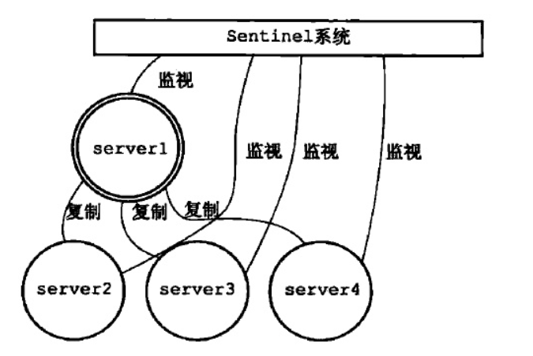
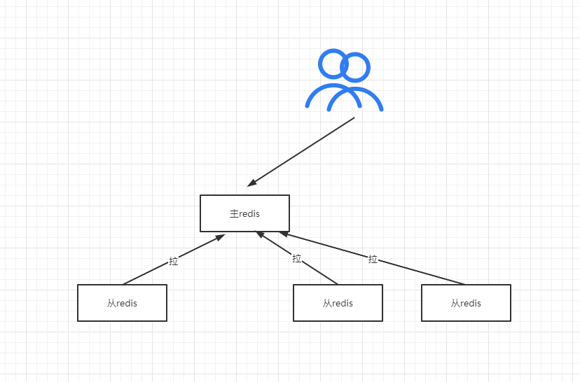

   提起Redis,我们都知道他是内存性数据库,非常快。可以有很多个数据结构。可以用它放在项目中做缓存,提高响应速度。但是仅仅如此 我们了解到的东西其实也就这么多。
   对于原理了解的并不清楚
   * Redis 是单线程还是多线程的？如果是单线程的 是怎么实现每秒十万并发的？
   * Redis 线程模型？
   * Redis 事务是什么？
   * Redis 持久化机制？
   
### 1.Redis 线程模型
   
   提起redis 的线程模型,我们要知道它是基于Reactor模式开发了**文件事件处理器**,它的消费是单线程的，所以才说Redis是单线程的.
   我们要明确这几个角色 Socket、Io多路复用、事件分派器、事件处理器
   * Socket 每一个客户端连接redis 都是通过socket和服务端的Socket 连接的 这个时候联立了连接 在服务端的标识就是服务端的socket。
   * Io多路复用 这个是非阻塞的IO多路复用 是redis为什么快的原因,他主要负责的就是轮询许多个socket 将产生事件的推到队列中 不对这些进行处理
   * 文件事件分派器 他主要的任务就是将队列中的事件拿出来根据处理器的类型分派给不同的处理器
   * 事件处理器  这个就是将分派的事件给处理了 单线程的操作 毫秒级 纯内存操作 更快
        1.命令请求处理器  为了接收客户端传来的命令请求， 服务器要为客户端套接字关联命令请求处理器。
        2.命令回复处理器  为了向客户端返回命令的执行结果， 服务器要为客户端套接字关联命令回复处理器。
        3.连接应答处理器  为了对连接服务器的各个客户端进行应答， 服务器要为监听套接字关联连接应答处理器。
        
### 2.Redis的数据结构
   首先明确 redis 的数据存储都是 key-value 存储的，而底层是采用了哈希表来实现索引的。  这下面说的数据结构都是value 的数据结构。
   
   
   #### 2.1 String
   这个不用多说 就是普通的key -value 存储的. 
   ```text
   // 设置值
   set key value 
   // 获取值
   get key
   ```
   
   #### 2.1.1 bitMap 位图
   在字符串上面延伸出来的,实际存储的就是byte数组  但是占用空间小 只存0或1，我们时常用 偏移值来代表一个用户的标识 然后用key 来标识一个业务标识 这样是value的横向扩展
 
   ```text
    //设置值
    setBit key offset value
    //获取值
    getBit key offset
   ```
   
   
   #### 2.2 hash 
   这个存储可以说是 里面是 map 的类型 用于存储一个对象 然后拿出来改一改 其实就是一个 key 就是一个对象名 然后 key value  就是属性 和对应的值
   ```text
   //设置值
   hset key key1 value1
   //获取值
   hget key key1
   //获取所有的键值
   hgetall key
   ```
   
   #### 2.3 list
   存储的就是一个list 用于文章的评论,或者粉丝的列表, 列表是双向列表 可以从左或者从有取或者放  lpush lpop rpush rpop
   ```text
   //左放进去
   lpush key value
   // 列表长度
   llen key
   //获取列表中的值
   lrange key start stop
   //从右侧移除一个 
   rpop key 
   ```
   
   #### 2.4 set
   存储的是一个 不重复的list  
   ```text
   //添加元素
   sadd key value1 value2
   //获取元素
   smembers key
   ```

   #### 2.5 sortset(zset)
   是一个顺序的不重复的列表  通过 score 来排序的
   ```text
   //设置值
   zadd key score value
   //获取值
   zrange key start end WITHSCORES
   ```

### 3. Redis 淘汰机制
   其实在redis中 你设置了过期时间，时间到了也不会被删除，还会占用内存空间，因为如果后台轮询这个的话比较占cpu进程，所以有两个方式清除  
   * 每隔一段时间随机抽取key如果过期了就给删除
   * 当访问这个key的时候会判断是不是过期了，如果过期了就会删除
   
   如果都没有设置过期时间 再放进新的数据在进来内存的淘汰机制
   * noeviction：当内存不足以容纳新写入数据时，新写入操作会报错，这个一般没人用吧
   * allkeys-lru：当内存不足以容纳新写入数据时，在键空间中，移除最近最少使用的key（这个是最常用的）
   * allkeys-random：当内存不足以容纳新写入数据时，在键空间中，随机移除某个key，这个一般没人用吧
   * volatile-lru：当内存不足以容纳新写入数据时，在设置了过期时间的键空间中，移除最近最少使用的key（这个一般不太合适）
   * volatile-random：当内存不足以容纳新写入数据时，在设置了过期时间的键空间中，随机移除某个key
   * volatile-ttl：当内存不足以容纳新写入数据时，在设置了过期时间的键空间中，有更早过期时间的key优先移除
   
### 4. redis 的持久化
   redis是一个内存型的数据库 但是为了保持数据的不丢失 是会持久化的磁盘的两种持久化的方式 RDB和AOF  什么情况下用什么持久化方案
   
   ####4.1 RDB(快照持久化)
   讲的是数据以快照的形式保存到磁盘上(一次全量备份)，指的是每隔一段时间将快照写入磁盘,写入的方式有三种
   * 第一种是save 命令触发,将数据写入磁盘,当触发的时候会阻塞其他的线程 显然是不可取的
   * 第二种是bgsave 命令 看名字是后台保存 是fork 一个线程后台去写入磁盘 
   * 第三种是自动触发 这个是常见的手段 通过配置文件 save m n  当m秒内有n次操作就触发
   
   ####4.2 AOF(追加文件)
   全量备份总是耗时的 还容易在备份的时候丢失数据 这个是将每次更新的数据write 追加到文件中 理解来说就是日志记录。
   * 每修改同步always：同步持久化 每次发生数据变更会被立即记录到磁盘 性能较差但数据完整性比较好
   * 每秒同步everysec：异步操作，每秒记录 如果一秒内宕机，有数据丢失
   * 不同no：从不同步
   
   #### 优缺点
   恢复的时候快照的容易恢复 aof 因为文件重写优化(同一个记录后一个可能会复写前一个) AOF 可以更好的保证数据不丢失，但是同一个文件要比快照要大.
   如果只是把redis 当成一个缓存服务器来用的话 至少可以开启RDB 这样是不耗费性能的因为是后台fork一个进程进行持久化的.
   
### 5.Redis 的高可用 (redis 作为缓存 肯定不能是单机 的 如果这台机器挂了怎么办？)
   如果redis 分布式了 那肯定是绕不开CAP的 不是单机的话分区容错性 肯定是实现了的 现在就是在可用性和最终一致性上面做的考虑 牺牲哪一个
   
   >一个slave机器的单机可能封顶就只有两万.
   
   #### 5.1 主从模式 - redis replication
   这个模式主要就是部署多台服务器,分为一个主服务器 一个或者多个从服务器 其他的服务器从主服务器拉数据.
   * Master主服务：被复制的服务器  一般用来写数据， 主服务器一般至少要开启RDB持久化
   * Slave从服务器： 对主服务器复制的叫做从服务器  一般用来读数据
   
   这个模式是主服务器进行读写,写的数据同步给从服务器,从服务器只能进行读操作。当主服务器宕机之后需要人工指定另一个从服务器作为主服务器
   
   ##### 5.1.1 主从复制原理
   1. 在从服务器重启或者初次连接的时候，会往主服务器发送sync命令
   2. 主服务器接收到sync 命令的时候，会执行bgsave 吧所有的写入命令都写入一个**缓冲区**中(无论多个从服务器，主服务器只有这一个缓冲区)
   3. 执行完bgsave之后主服务器会把rdb文件传给从服务器，从服务器加载到内存中，然后把缓冲区的内容发送给从服务器(这里存在一个主服务器id和offset偏移)
   4. 如果传输到一半断了，那么从服务器会吧这个主服务器id和offset传过来，主服务器看这个偏移是不是在自己的缓冲区内，如果在就将之后的传输过去，否则传输全部
   
   ##### 5.1.2 过期key处理
   如果在主服务器将这个key删除了，会执行一个delete 同步给从服务器
   
   
   #### 5.2 哨兵模式
   > 一个哨兵其实是服务器上的一个进程

   上面主从模式有个缺点 就是当主服务器宕机之后 需要人工指定另一个主服务器 哨兵模式其实就是对上面的一种拓展 理解为一个或多个哨兵在监控是不是有
   服务器挂掉了 对这些个服务器进行监控 如果有服务器挂机了 可以动态的调整主服务器
   
   必须要有三个或以上的哨兵才是高可用的,因为master 宕机可能连那个机器上的哨兵都宕机了,而必须要两个哨兵投票选举一个master 
   
   ##### 5.2.1 异步复制
   
   ##### 5.2.1 集群脑裂
   
   
   #### 5.3 集群模式
   集群是redis提供的分布式数据库方案,集群是通过分片来进行数据共享,并提供复制和故障转移功能,一个redis 集群通常由多个节点组成的.
   最初，每个节点都是独立的，需要将独立的节点连接起来才能形成可工作的集群。
    
### 6.问题解决方案
#### Q: 缓存和数据库之间一致性的问题？
   主要就是说在查询缓存和数据库之间同步的时候那一点时间的数据不一致问题 比如  
   先删redis 写数据库， 这个时候另一个读redis没有读数据库 反写回redis 这个时候redis 就是脏数据
   * 延迟双删策略: 先删缓存 再写数据库 再删缓存
   * 异步更新缓存(基于binlog实现): 订阅binlog 然后发送mq redis 再更新

#### Q: 缓存穿透解决方案?
   穿透 顾名思义 就是访问到了不存在的key 导致访问到数据库
   * 缓存空值: 将请求到的值缓存到redis  （治标不治本）
   * 布隆过滤器: 将数据库的值放到布隆过滤器中 不存在的值 布隆过滤器直接返回不存在的 到不了数据库
   
#### Q: 缓存击穿解决方案？
   击穿 顾名思义 就是一个值失效了 大量请求到数据库了
   * 使用互斥锁来实现 等第一个线程拿到锁请求到数据库 回写缓存 其他的就能查到了
   
#### Q: 缓存雪崩？
   顾名思义  就是大面积失效了 这个主要看是redis 挂了还是怎么样
   * 事前： 使用集群 或者哨兵之类的
   * 事中: 在mysql 那边用限流 或者服务降级
   * 事后： redis 的持久化机制 恢复数据
   
#### Q: 如果要单机redis 可以支撑 20w 的并发 应该怎么做
   基本上这种并发 或者以上的并发可以考虑 读写分离 和 主从模式结合  就是主只负责写 然后将数据同步给从  
   然后从只负责读  并且支持水平扩展  
   
   
   
   
   
   
   
   
   
   
   
   
   
   
   
   
   
   
   
   
   
   
   
   
   