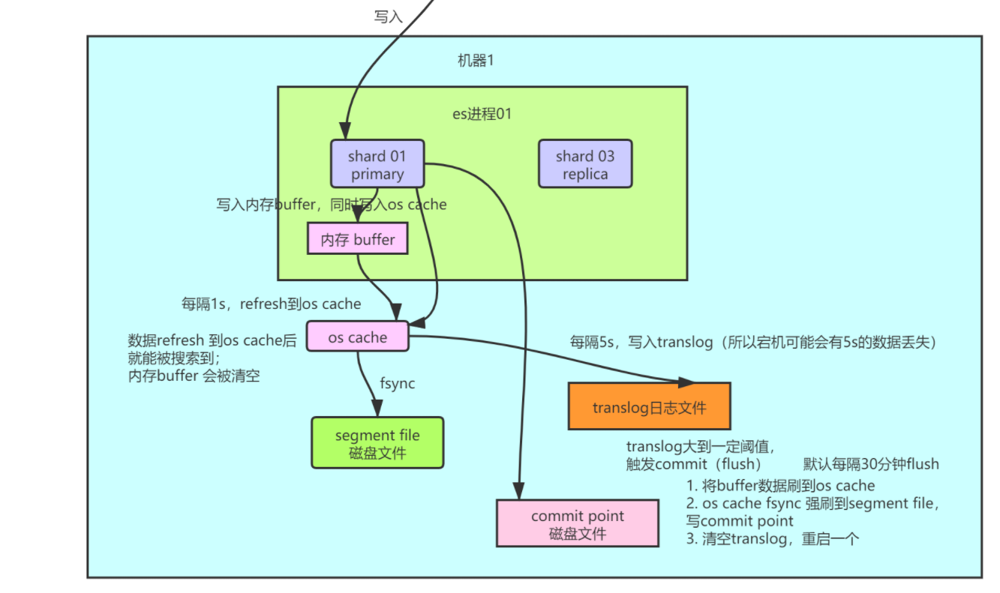

> 人生在世，无法预知未来。幸与不幸，总须坚持到最后才能知道。所以，人生的好坏都取决于心态。你的心态好，坏事变好事；你的心态不好，好事也变成坏事。


### 一、为什么要用es 解决了什么问题,带来了什么问题
   当你在对文档中的数据进行搜索的时候,那你用的是常用的mysql 数据库，可以用like 语法,但是like语法是不走索引的，当你数据量非常大的时候这样就会非常的慢  
   
   但是如果用es,es底层是使用倒排索引，什么叫倒排索引，就是对要分词的字段进行分词 然后把引用到的数据当做value 就相当于你拿过来搜索的条件
   已经被当成一个字段用来搜索的,并且是放在内存中的 所以非常快  
   例子：
   ``` text
              静夜思
       床前明月光，疑是地上霜。
       举头望明月，低头思故乡。
   
               望月怀远
       海上生明月，天涯共此时。
       情人怨遥夜，竟夕起相思。
       灭烛怜光满，披衣觉露滋。
       不堪盈手赠，还寝梦佳期。
       
  ```
  现在是
  
  ```text
      明月       静夜思,望月怀远
      地上       静夜思
      情人       望月怀远
  ```
   
### 二、初步了解 
   
   #### 2.1 es中的名词
   当你使用es 的时候,是用到里面的一些模型
   * Document & field： 最小的数据单元,一般存一个json数据,相当于一条数据， 每个index下面的type ,都可以存储多个 Document, 一个Document下面许多 field(相当于列)
   ```text
{
    "product_id": "1",
    "product_name": "iPhone X",
    "product_desc": "苹果手机",
    "category_id": "2",
    "category_name": "电子产品"
}
```
   * Index: 索引 包含类似的一堆结构相似的文档
   * Type: 索引中包含一个或多个type，类比于mysql中的表，每个type的数据结构可能不太一样
   
   #### 2.2 集群中的名词
   es 肯定不会部署在一个机器上的,单机无法存储大量的数据, 这样es把一个索引中的数据分为多个shard, 分布在多个机器上面存储，这样就可以横向扩展
   * primary shard： 这个相当于是会读取的数据, 类比于 hadoop中的 datanode 的主节点
   * replica shard： 这个相当于一个备份,多个 还能提高吞吐量和性能
   
### 三、es进阶
   首先es 客户端进行读和写的时候是会  将读取或者写入的doc id进行hash 这样可以确定一个  coordinating node（协调节点） 之后就是协调节点进行的操作
   
   #### 3.1 es写入流程
   * 客户端选择一个 node 发送请求过去，这个 node 就是 coordinating node（协调节点）。
   * coordinating node 对 document 进行路由，将请求转发给对应的 node（有 primary shard）。
   * 实际的 node 上的 primary shard 处理请求，然后将数据同步到 replica node。
   * coordinating node 如果发现 primary node 和所有 replica node 都搞定之后，就返回响应结果给客户端。
   
   
   #### 3.2 es 写入的详细流程
   
   1. 当
   
   #### 3.3 es读取的流程
   从 primary 和 replica 之间读负载均衡
   
   #### 3.4 当大数据量的时候 怎么进行优化
   在es查询的时候，会将查询的数据从磁盘中转移到 filesystem cache 中 那这个就是越大越好 这个是走内存的 非常快, 但是这个内存大小是有限的 如果想让他放更多的数据，
   那么我们就要将es中存储的数据尽可能的小, 我们可以通过 es+ hbase 的架构实现 在es中放要搜索的数据 然后值对应一个id 再根据这个id去hbase中查询 这样就非常优化了。
   
   数据预热：  
   自己弄一个子系统，提现吧这些热数据访问一下 将他们放在 filesystem cache 中 
   
   document 模型设计：   
   在涉及这个模型的时候 就将要查出来的数据放进去 这样就不用查出来再关联查询了
   
   


