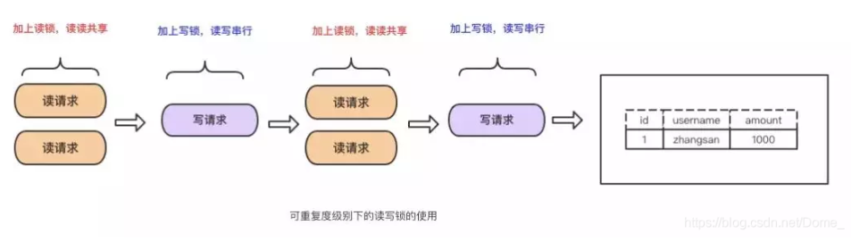

> 所学越多，所知越少。
### 一、介绍

数据库就是存储数据的一个地方 有几种不同的存储方式
    存储格式: 底层是以页存储的 默认 16kb 所说的b + 树  中间节点一页可以存储很多  叶子节点 一页可以存储就要看数据多大了  
            重点: 底层 已 b+ 树的格式存储数据页 (理解:已b+树的方式找到数据页) 在页上面存储 已链表链接的行数据(理解:行头中变长列值 的768 个字节作为索引 多的就放在别的里面)  
    分为**数据块** 和**索引块**  
        创建表的时候默认以主键在数据库中建一个 b+树索引  将所有数据都放在叶子节点上 以主键作为中间分支的
        当创建索引的时候 这个时候是在索引块里面 放一个 b+ 树的叶子节点放的都是这个列的值和主键

数据库的存储引擎:  (底层的引擎)  
   * innoedb ：支持事务,  基本上是mysql 的默认引擎  读写速度都还行(为什么)  默认主键是 聚集索引 
   * MyIsam  :  不支持事务   写的速度慢 但是读的速度快   默认是非聚集索引 虽然是以 b+树存储 但是存储不是顺序的 写值的时候 会慢 要查找之前的
                (是不是因为不是自增做主键的 所以插入的时候 叶子节点分裂 成本较高)

   #### mysql 架构:
   


   #### InnoDB引擎架构
     
   我认为这个和java 加载类就有点类似了， 因为是先存在磁盘上， 然后加载到内存中作为缓冲。 


### 二、缓存:
   当请求来到数据库 首先是要查询mysql的缓存的 缓存区分为下面几个
   * buffer pool: innodb 在内存中的缓存,用来客户端访问到硬盘中的数据层和索引层的数据之后 会把这些数据放进来 这个缓冲区采用 LRU 算法 以7:3 的比例 将老的页面给淘汰掉
   * change buffer:  产生原因是因为 数据块和索引块存于一个idb文件中 而二级索引是没有顺序的比较随机 进行插入或者更新这个数据的时候要更新索引数据是比较费时的 所以 当有
​                    insert 或者update 的时候将这些数据缓存在 缓存池中 然后在系统空闲或者慢速运行的时候 将**一系列索引值**写入索引块中 这样避免了在磁盘产生大量的随机IO访问获取普通索引页
   * log buffer: 日志缓冲 用来保存要写入磁盘的日志文件 有几种不同的级别 可以通过innodb_flush_log_at_trx_commit 来设置
        1.   事务提交完之后 只写到 log buffer 中 然后每秒刷到缓存然后更新到磁盘 未更新的可能会丢失
        2. 事务提交完之后就把日志更新到磁盘 
        3. 事务提交之后 写到 page carsh 中 然后每秒更新到磁盘 

### 三、索引(为数据存储在硬盘上提供更快的查找提供便利):
   #### 3.1索引的存储结构:
   * Hash表:  hash 一个最重要的特征就是以空间换取时间 查找非常快  基本上一个字段加上了 hash 索引的话 = 这种比较频繁的话 用是比较方便的 因为不是顺序存储的 所以范围查询不走索引
   * B树  :  就是二叉树 加平衡算法  所有节点存储一个关键字
   * B+树 :   树的底层是二叉树这种 基本上是以二分法来找 这样非常快  特点就是  
    1. 中间节点只保存下个节点的引用 不存放数据 所有的数据都存放在叶子节点中  
    2. 叶子节点 之间是以链表链接的  这样可以用作范围查询非常快  
    3. 所有中间节点都在子节点中 是子节点中的最大或者最小 
    
   #### 3.2 索引类型:
   * 唯一索引: 一列数据如果建立了唯一索引 那么他的数据是不能重复的 每一个都是唯一的 
   * 主键索引: 一张表中只能有一个主键索引  主键索引不能重复 并且唯一 不能空 
   * 联合索引: 将几列放在一个索引中 如果有三个的话  (a,b,c) 建立的是 a  (a,b) (a,b,c) 遵循从左原则 如果只查 b 是不走索引的 但是查 a  是走索引的
   * 聚集索引: 其实就是上面的主键索引(也许和索引不同的就是他是存储在数据块中的) 因为只有一个 所以你设置成主键索引的时候 默认就设置成聚集索引了  这个时候是吧所有的字段和主键都放在这个叶子节点上面    
   
   搜索原理：  
    select * from user where name = '' and age > 15 and age < 30;  
     hash 表: 将name hash 然后直接找  
     B 树 : 查询 age 等于15 的 然后中序遍历 找到结尾 比较耗时  
     B+ 树: 查询age 等于15 的叶子节点 然后通过叶子链表 直接找到最大数   
     user表  id  name  age  height       id 主键索引   (name,age) 联合索引
     select height from user where name = '张三';       
     这个时候 条件name 是有索引的时候(去索引块里面查询对应的值) 查询到叶子节点上面的值name和id 没有height 这个时候回表查询(去数据块里面根据id)根据id走聚集索引 
     查询到所有的数据将height 返回 

### 四、存储
   
   存储涉及到的文件后缀名的说明:
   * frm：通常创建一个表之后 这个表的结构信息会存在这个地方.
   * idb：创建表之后 表的数据和索引,应该都是存在这个地方的,
   * iddata: 系统表空间的文件

   #### 4.1表空间:
   * 系统表空间：在5.7之前 所有的数据文件都是放在系统表空间的 
   * 独立表空间：5.7 之后 引入了这个,所有用户自己创建的表都是放在独立表空间数据里面的  用那个idb存储,
       - 缺点是每个表先分配大小 别的表不能享有 这样可能会造成空间浪费
   * 通用表空间: 通用的表空间,就是放共享的表或者数据,可以存储多个表的数据
   * undo 表空间： 顾名思义 就是放undo log的，undo log可以存储在一个或多个undo表空间中，而不是系统表空间中。
   * 临时表空间： 服务启动的时候创建,关闭的时候销毁,一般用在 UNION 关联查询的时候 创建临时表的时候。

   #### 4.2 idb文件结构
     
   
   
   
   * 页存储: 是比端和区 更小的单位  也是mysql 存储的最小单位 具体数据格式可以看图  有头和啥的 中间 存的是好多行 
   * 行存储:    行存储 数据是放在中间的 但是行存储 好像有行模式  COMPACT 和  DYNAMIC  
            行存储 最大65535 个字节 如果字符集是 UTF-8 的话 一个字符 是三个字节  这样就会少一点
    
   数据页是以索引结构的方式存在于这个下面的。 上面是b+树索引式的存储。
            
### 5、日志
   日志是mysql非常重要的部分,我们要想了解日志,首先明确上面架构**服务端**和**存储引擎端**,当更新一个数据的时候日志流程是这样的.  
      
   1.执行器从引擎中找到数据，如果在内存中直接返回,如果不在内存中，查询返回  
   2.执行器拿到数据之后会先在内存中修改数据，将之前的数据写入到undo log中,
   3.引擎将数据更新到内存中，同时写数据到redo log中，这时处于prepare阶段，并通知执行器执行完成，随时可以操作  
   4.执行器生成这个操作的bin log,并调用引擎的事务提交接口  
   5.引擎把刚刚写完的redo log的prepare阶段改为commit 阶段，更新完成  
   
   redo log 和 bin log的持久化是可以设置的参数的  所谓双 1 就是 都设置为 1 
   
   
 #### 5.1、Redo log 存储引擎的日志文件:
   大白话: 为了提升性能 **不会每次修改都会修改磁盘这样慢** 会将这些放进缓冲区 但是断电不安全  就会有一个后台的进程去跑 将redo log 持久化到磁盘 用于故障修复  
   也记录了事务的行为， 事务的状态 prepare 和commit 状态都是这个记录的  
   主要用于数据恢复,每次修改和删除操作都会先在这里记录一下 循环写入 有两个指针,这个在binlog 没有commit之前就
    吧数据写到磁盘中这样 故障恢复的时候就可以找 这个写进去了 而binlog没有提交的 做故障恢复 由两步分组成   
   * 重做日志缓冲区log buffer 位于内存结构中 不在磁盘结构中 
   * 重做日志文件 在磁盘结构中 id_logfile1 id_logfile2
   
   这里解释一下 不是事务就是用redo log来实现的，而是其中的持久性是用这个来实现的，一次事务的提交可能是要改好多表的，这样一次性的改**性能很差**， 所以
   事务提交了 是先写log 然后在异步去同步到磁盘上(刷盘)， 这里刷盘可以通过 innodb_flush_log_at_trx_commit 控制是每秒刷 还是提交事务刷 还是不刷盘
   
   
 #### 5.2、bin log 服务端的日志文件
   大白话： 将所有逻辑以一个追加形式写入一个二进制文件  
   是一个二进制文件 记录了所有的更改 主要用作记录时间点 对sql 进行了更新 删除操作主要用于
   1. 主从同步 主服务器将这个发送到从服务器 
   2. 从服务器执行 同步  还可以用于还原
   
   相关命令:
   ```sql
    -- 查看binlog 的路径
    show variables like '%log_bin%'; 
    -- 查看当前binlog 的状态 
    show master status;
    -- 将binlog文件导出为sql文件查看
    -- mysqlbinlog.exe -uroot F:\binlog.000050 >f:\binlog.sql  

``` 

   ##### 5.2.1 binlog 解析工具
   当我们需要监听mysql的数据的变更 做同步、发送到kafka、增量到搜索引擎、数据分区迁移、切库binlog回滚方案 等等, 常用的有  
   * maxwell： 使用简单，它直接将数据变更输出为json字符串，不需要再编写客户端。 
   * canal： 由Java开发，分为服务端和客户端，拥有众多的衍生应用，性能稳定，功能强大；canal 需要自己编写客户端来消费canal解析到的数据。
   
#### 5.3、undo log 存储引擎的回滚日志  
   大白话: 在数据的头文件中 存储修改之前的数据 和版本号 这样出现错误了 可以直接回滚   
    在事务没有提交的时候 每执行一个sql 就生成一个undo log 放在行记录的DATA_ROLL_PTR 中 如果是删除的 直接放在行记录头信息里 标记为删除
    事务提交的时候 将undo log 删除
    
#### 5.4、redo log 和 bin log 的不同之处？
   1.Redo Log是InnoDB引擎特有的，而binlog是MySQL的Server层实现的，所有引擎都可以使用。  
   2.Redo Log的文件是循环写的，空间会用完，binlog日志是追加写的，不会覆盖以前的日志。  
   3.Redo log是物理日志,记录在某个数据页做了什么操作,bin log是逻辑日志,记录了这个语句的原始逻辑

   #### 5.5 更新一条数据的流程
   一条 update sql 过来的时候


### 六、事务

   事务的原理就是通过**日志**和**锁**来实现的,其中最重要的是一致性,其他三个都是为了最终一致性做铺垫.  
   #### 6.1 事务的特征
   * 原子性： 一组事务要么同时成功 要么同时失败,原理是 如果失败了 undo log 回滚 
   * 隔离性： 定义了四种隔离级别  是 可靠性和性能之间的权衡  默认的隔离级别是可重复读  原理是用锁 保证数据不会被其他的事务更改
   * 持久性： 事务一旦提交, 将永久保存到数据库中不会断电消失 , 原理 因为事务提交之后是通过redo log 同步到磁盘的 所以是通过redo log 实现的
   * 一致性： 事务总是从一个一致性状态 转移到另一个一致性状态, 例如 开始A+B 5000 无论怎么转账 结束A+B 也是5000  通过原子性、隔离型、持久性完成

   #### 6.2 事务的隔离级别
   上面的undo log 上是事务没有提交的时候在 行记录上面生成这个记录  但是多个事务一起在操作的时候 就是并发事务的时候 就会出现几种
   * Read uncommitted(读未提交): 就是一个事务可以读取另一个未提交事务的数据。
   * Read committed(读提交): 就是一个事务必须等到另一个事务提交才能读取数据。
   * Repeatable read(重复读):就是在这个事务开启的时候 不在允许别的事务修改数据 别的可以读 但是不能修改 一般是加行锁
   * SERLALIZABLE (可序列化): 不管多少事务，挨个运行完一个事务的所有子事务之后才可以执行另外一个事务里面的所有子事务
   
   #### 6.3 事务的锁
   * 共享锁(读锁): sql 后面加 lock in share mode   加了这个锁之后 其他的共享锁 可以读取 不允许其他的加排它锁； 
   * 排他锁(写锁):  sql 后面加  for update  加入了排他锁之后  其他的事务 不能用 读锁或者写锁   
                    排他锁又分为 行锁和表锁 行锁是锁住了这一行 表锁 是锁住了 整个表的其他用户的读写操作.

   #### 6.4 MVCC 是什么？ 怎么实现的？

### 七、分库分表
   参考[git](https://github.com/yudiandemingzi/spring-boot-sharding-sphere)  
   任何技术的出现都是为了解决一个问题的痛点的,  
   
   |  #  |  分库分表前    | 分库分表后      |
   | -------- | -------- | --------         |
   | 并发⽀撑情况   |    MySQL 单机部署，扛不住 ⾼并发 |    单机到多机，能承受的并发增加了 多倍   | 
   | 磁盘使用情况     |   单机磁盘容量几乎爆满      |       拆分多个库 磁盘使用率大大提升     |
   |  SQL 执行性能  |   单表数据量较大 sql 越跑越慢  |   单表数据量减少  效率提升         |
    
   #### 7.1 分表
   分表是因为单表数据量过大影响sql查询性能, 分表的时候 应该明确根据哪个字段来分 并且要是int 类型 取模的 
   
   #### 7.2 分库
   分库是因为单库有并发查询上限,最多并发2000, 所以弄多个库 这样并发量就上来了

   #### 7.3 分库分表中间键
   * Cobar： 阿里开源的proxy 层方案, 没啥人用了
   * TDDL: client层方案支持基本crud 不支持join 多表查询
   * Atlas： proxy 层方案 没人用了
   * Sharding-jdbc： 支持 ⽀持分库 分表、读写分离、分布式 id ⽣成  中小型推荐使用 运维成本低 
   * Mycat ： proxy层方案 功能完善 大公司推荐使用 缺点在于需要部署，⾃⼰运维⼀套中间件，
   
   #### 7.4 水平拆分 
   水平拆分是吧一个表的数据给放在多个表或者多个库中，表的结构一样，数据量不同
   
   #### 7.5 垂直拆分
   垂直拆分是吧一个表的数据 按照字段不同给拆到不同的库或者表中  结构不同 ，行数相同  
   将比较少的 访问频率较高的字段放在一个表中， 将较多的 访问频率较低的字段放在一个表中

   #### 7.6 分库分表可能带来的问题
   
   ##### 7.6.1 分表是怎么做到查询就快的？
   shard-jdbc 有五种分片策略, 其中四种是查询条件必须要包含分片的那一列 这样对这个hash 就可以知道要查哪几种了  
   
   ##### 7.6.2 分表条件下的分页查询 
   [答案](https://mp.weixin.qq.com/s/h99sXP4mvVFsJw6Oh3aU5A?)
   
### 八、读写分离
   因为大部分是读多写少,所以通过读写分离可以支撑更改的读并发,   
   实现方案是通过主从复制, 并且从库可以水平扩容  
     
   
   #### 8.1 读写分离的优点
   * 可以抗住更高的读并发
   * 可以水平扩展，支持更多的机器扩展
   
   #### 8.2 可能产生的问题 - 延时问题
   因为从库读取数据时串行的，所以会导致主库更新完数据，从库串行会有几十甚至几百ms的延迟，可以查看 Seconds_Behind_Master 看到延迟，如果延迟严重 有几种解决方案
   * 分库： 将多个主库拆分成多个主库 这样写并发就减少几倍 主从延迟就比较少了
   * 并行复制： 打开mysql 的并行复制，从库开启多个线程，并行读取 relay log 中不同库的日志
   * 对于敏感操作 强制走主库
   
   #### 8.3 可能产生的问题 - 数据丢失
   如果主库写完没有同步到从库 这个时候主库挂了，那数据就没得了  
   这个时候可以开启半同步复制，就是主库写binlog 会强制同步从库，从库将日志写入本地的  relay log 之后 返回一个ack，主库至少接收一个从库的ack 才会认为写
   操作完成了
   
### 九、数据库调优
   数据库的调优是从写sql语句开始的，可以调优就是sql 写的不是那么的规范
   1. 尽量不要用 select * 需要哪些查哪些。
   2. join的时候 尽量走索引，join小表
   


### 问题
#### Q: 可以怎么实现可重复读？
   可重复读是指多次读取的数据都是一样的。实现方式有两种 一种是通过读加锁来实现  一种是通过MVCC来实现
   
   为什么能可重复度？只要没释放读锁，在次读的时候还是可以读到第一次读的数据。
   * 优点：实现起来简单
   * 缺点：无法做到读写并行
      
      为什么能可重复度？因为多次读取只生成一个版本，读到的自然是相同数据。
   * 优点：读写并行  
   * 缺点：实现的复杂度高
                   
#### Q:两个事物对同一条记录操作?
​    这个时候看是读还是写,如果是读的话 两个事物读取的都是快照 之前的数据  如果是更改的话 那么会对这一行加锁 等这个事务提交了 另一个才能操作。

如何将一个 语句写到 sql 中   update t set a=10 where id=1;
    首先可以通过 innodb 引擎架构 链接到mysql client端 验证用户名密码 查询缓存 有没有id为1 的  没有击中缓存(每次查询完之后会把之前的数据放在 
    buffer pool 缓冲池中)  分析器->优化器->执行器 然后就是底层引擎和数据库打交道了  
    这个地方比的是 innodb搜索引擎 首先 查询id 为1 的 找到了之后 将 a设置为10 调用写入接口 将数据更新到内存中 redo log中 和在
    bin log 中记录一条记录 然后调用事务接口 将数据写入到磁盘中   

#### Q: 为什么不用select * 查询 
​    首先使用select *  查询到非常多不必要的数据 造成网络io 的拥堵  
​    其次 mysql 存储是一页 16kb  系统是4k 读取的 这样查询所有有可能是多读几次的
​    
#### Q: varchar 和 char 有什么区别, 为什么要用 varchar(255)  varchar() 最大长度是多少
​    VARCHAR的最大长度 = （最大行大小 - NULL标识列占用字节数 - 长度标识字节数） / 字符集单字符最大字节数
​    varcchar 是可变长字符串  如果超过存储的长度 不会填充 是以一个字节的位数来存储长度  
​    char 是字符串 如果超过存储的长度 是以空格填充的       
​    每个行 最大长度是 65535 个字节 
​    如果是使用 行模式使用的 是 compact  使用768 个字节作为索引 如果超过是需要放在
#### Q: mysql 对于大字段是怎么存储的,为什么varchar() 为什么要用255 ？
​    在 COMPACT行模式下 对于大字段存储 是将前 768个字段放在索引页记录上 将其他的部分开20字节指向剩余的位置 
​    而在一个字符是3个字节 所以除以3 是 256 一个字节是 存储长度  
​    第二种说法是 大于256 个字节需要两个字节来存放长度 所以基本上是255 这样节省一点内存

#### Q:那你知道什么是覆盖索引和回表吗？
​    当你查询的一条语句中,它查询所需要的字段都在这个索引中 那么就叫他覆盖索引, 这个时候就不需要回表查询,如果没有包含全 这个时候就需要根据id 再通过聚集索引来回表查询
​    
#### Q: 你知道的mysql 的锁有哪些?
​    读写锁

#### Q：你们数据量级多大？分库分表怎么做的？
​    一个表的数据量很大的时候 肯定会就考虑分表了  一般分表 是以 时间段分表和分字段分表(将一些大字段加到另一个表中) 如果查询跨表的就联合中间表查询 

#### Q: 分表后 id 是怎么保证唯一的？
​    一般是分布式id服务 保证id 的唯一  雪花算法等   还可以指定每个表的唯一字段 比如订单号作为主键 
​    
#### Q: 为什么myisam 比innodb 读的速度快？
​    如果是非主键查找  innodb 是找到了 需要回表查找 而myisam 直接叶子节点 是 offset 直接物理地址  要快  innodb 支持事务 要维护 mvvc 也是一个原因

#### Q: count(1) count(*) count(id) count(字段) 哪个快
   count(1)和count(*) 这两个是一样的 获取到列 不拿里面的值 只是统计 count(id) 取这个列的id 的值 不为空 则计数  count(字段)  按照这个字段查找 找出这个字段 不为空则 计数
   执行效率对比：count(字段) < count(主键) < count(1)    
   
#### Q: 索引是越多越好吗 为什么 建索引有什么标准吗
   当索引多了的话 查询和更新就会变慢,如果主键索引没有规律的话,可能每次更新和插入都会重排索引,所以一般索引最好不要超过八个
   
#### Q: 当delete 之后表空间的数据被删除了吗？
   当 delete 带上where 条件时,只是将数据标识位删除,并没有真正的删除 ,这个时候有新数据写入的时候 ,mysql 会利用这些已删除的文件写入, 删除操作会带来数据碎片,正是这些碎片在占用空间
   可以执行   OPTIMIZE TABLE  XXXTable(自己的表名) 来释放 ,不过这个操作会锁表, 可以一个月操作一次就够了
   
#### Q: 主从架构 从库不能写 是怎么从 主同步数据更新的？
   从库连接主库进行更新数据时**串行**的,不是并行的 这也就导致了 主库更新了数据之后 从库不会立马更新完,会有几十甚至几百ms的延迟，
    
#### Q: 对于大数据表的操作是用sql 还是在程序中 在程序中会不会出现 oom？
   在对大表进行操作的时候 会遇到对数据进行复杂sql 操作 但是这样大表就会慢 但是这个时候放在程序中 由于对象过多 可能会oom 这个问题怎么解决？
   
#### Q: 经常用delete 语句吗，删除完了之后磁盘会小吗？
   
   首先我们明确数据的存储是以页的形式，B+树的结构存储上去的，如果是删除和新增可能会导致页分裂、空洞(将一页中的某个数据给删除,那个地方为空)  
   这样我们如果删除大量的数据，只会导致大量的空洞，后面新增数据的时候会频繁的页分裂，所以建议是逻辑删除  
   综上所述，删除不会减小磁盘大小，产生大量的碎片，并且如果我们进行碎片回收，会消耗大量的cpu 并且回收的时候不能执行DML语句。